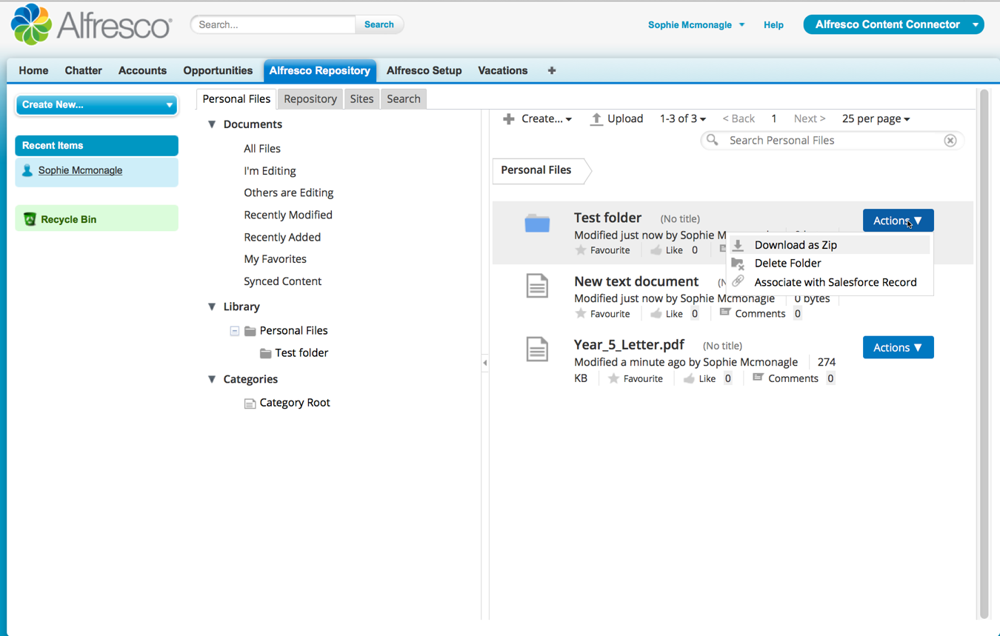
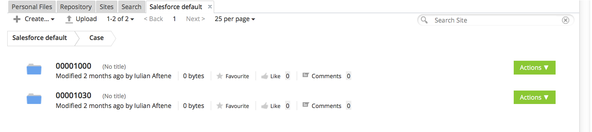

# Using the Alfresco Repository tab in Salesforce

You can use the Alfresco Repository tab to link a file or folder with a record, to add files or folders to Alfresco, and to find content.

1.  In Salesforce, click Alfresco Content Connector. This is available from the Force.com App Menu.
2.  Click the Alfresco Repository tab.

    Log in to Alfresco. Contact your system administrator if you don't know what your login details are for Alfresco. See [Logging in to Alfresco](http://docs.alfresco.com/5.1/tasks/gs-login.html) for more information.

    An Alfresco view is displayed, with tabs for Personal Files, Repository, Sites, and Search.

    

3.  On each tab you can:

    -   Search for content using the search box.
    -   Create a new folder or text document in Alfresco.

        Click the name of a folder and it opens in the current Salesforce view. Click a file and it opens a new Alfresco window showing the full details of that file. As you are already logged in to Alfresco, you don't need to enter your Alfresco login details again.

    -   Click Upload to navigate to content on your device and upload it.
    -   Add one or more files by dragging and dropping directly into the window. A new window tells you whether each file or folder has been added successfully.
    There's also a breadcrumb trail of folders to help you navigate.

4.  On each file or folder you can use the same actions that are available in Alfresco. For example, folder actions include Download as Zip and Delete Folder.

    There is an additional action, Associate with Salesforce Record. This allows you to link a file with a specific record in Salesforce. You can select from a list of recently viewed records. See [Linking Alfresco content with a Salesforce record](../tasks/salesforce-associate-with-record.md) for more information.

5.  Personal Files tab: You can add files here that are stored in Alfresco, but are not shared with other users. Any files and folders that you add here are shown in the Library \> Personal Files folder.
6.  Repository tab: This is a view of the full Alfresco repository, and is most useful for system administrators. This is the same structure that you see if you click Repository from the toolbar in Alfresco.
7.  Sites tab: This is a list of your Alfresco sites, and the place that most users look for their content. You need to be a member \(or creator\) of a site for it to be displayed here. If you click a site, it opens the contents into a new tab that has the same name as your site.

    For example, if I am a member of a site called Salesforce default, a new tab called Salesforce default is displayed where I can see folders and files:

    

8.  Search tab: Search in the repository or sites in Alfresco. The search uses the Alfresco faceted search and filtering. The usual Alfresco actions are available for any files or folders that are returned in the search results.

**Parent topic:**[Using Alfresco Content Connector for Salesforce](../concepts/salesforce-ent-using.md)

