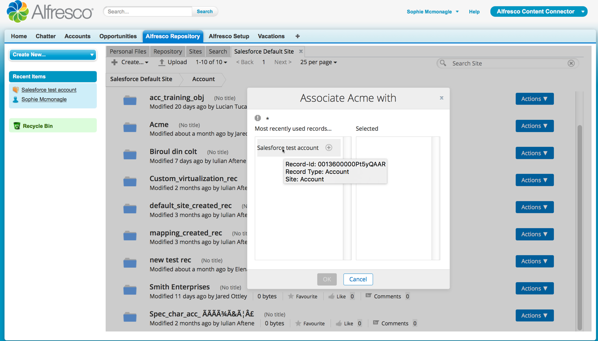
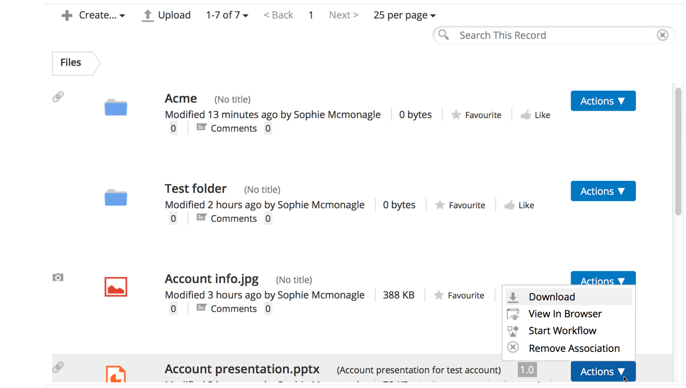

# Linking Alfresco content with a Salesforce record

Use the Alfresco Repository tab and Associate with Salesforce Record option to associate or link a file with a record in Salesforce.

When you are working with a Salesforce record, there might be marketing, customer-related or other files that you want to store alongside the record. Use this option to link your Alfresco files with your records. When you link a file, the record ID is stored in the parent folder.

1.  In Salesforce, click Alfresco Content Connector. This is available from the Force.com App Menu.

2.  Click the Alfresco Repository tab.

3.  Enter your Alfresco login details. Contact your system administrator if you don't know what your login details are for Alfresco. See [Logging in to Alfresco](http://docs.alfresco.com/5.1/tasks/gs-login.html) for more information.

    An Alfresco view is displayed, with tabs for Personal Files, Repository, Sites, and Search.

4.  Find the file or folder you require by searching or navigating. Right-click the file, select the record that you want to link from Most recently used records and click + and OK to link the record with the Alfresco content.

    On every file that you see in the Alfresco section, you have the option to Associate with Salesforce Record. This allows you to link content with a specific record in Salesforce. When you use this action, you can select from a list of recently viewed records to associate with:

    

    To better identify the record that you require, you can hover over a recently used record to see the Record ID, Record Type and Site that relate to that record.

     denotes that the file is now linked with a record. Also, in the Alfresco section of the Salesforce record itself, you'll see the same file is displayed as a linked file.

5.  Go to the Salesforce record that you used to link to your Alfresco content.

    In the Alfresco section of the record, you'll see the file is displayed as a linked file.

    

6.  Click the folder to open it in Alfresco.

**Parent topic:**[Using Alfresco Content Connector for Salesforce](../concepts/salesforce-ent-using.md)

