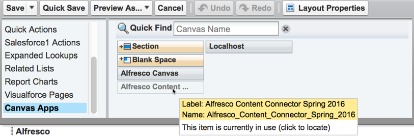

# 6. Adding the Alfresco app in Salesforce

Lastly, you'll need to load the Alfresco canvas app for page layouts. You can add the app to any record type that supports layouts \(for example; Accounts, Cases, and Opportunities\). This is done by setting Alfresco for Salesforce example page layouts as the default for selected user profiles.

Make sure that you've downloaded the Alfresco Content Connector app, as described here: [2. Installing the app in Salesforce](salesforce-ent-install-app.md). You need administrator rights to make these changes.

1.  In your Salesforce account, find Setup. This is often on the toolbar or under your name \(see [How to find Setup](https://help.salesforce.com/apex/HTViewHelpDoc?id=basics_nav_setup.htm) for more guidance on where to find this\).

    Search for Page Layouts in the Quick Find search bar, and in App Setup \>Customize, choose the page layout for your selected page type \(for example, Accounts\).

2.  Click Edit next to the layout you want and add the Alfresco app to the layout:

    1.  From the available components in the scrollable window, select Canvas Apps.

    2.  You might need to add a new section, depending on your page layout.

        If you need to add a new section, set it to 1-Column with a minimum height of 350 pixels \(400 pixels is the recommended height\). Click OK. Drag and drop the section onto your layout, and save the changes, before adding the new canvas app.

    3.  Click the canvas app that matches the Alfresco Content Connector connected app that you created in [Configuring your app in Salesforce](salesforce-ent-configure.md), and drag it to where you want it on your page.

        You can add a canvas app only once to a page. If you've already added the app, Salesforce shows you where on the page it has been added.

        

    4.  Set the canvas app to display in 1-Column with a minimum height of 350 pixels \(400 pixels is the recommended height\), and click OK.

        If the Alfresco widget is too small, you can't see all the buttons and elements. For instance, it is not possible to log in as the buttons are not visible.

    5.  Save your changes.

        It can take a little while for the Alfresco widget to load for the first time.

    6.  Open a record that has the new page layout. You should now be able to see an Alfresco section, with a Files tab. You can add files here by dragging and dropping them, or by using the Upload button.

        You can also add new folders with the Create button. Equally, any files added in Alfresco can be seen in this window. This content is stored directly in Alfresco and can be viewed either in Salesforce, or in your usual Alfresco site.

**Parent topic:**[Installing Alfresco Content Connector for Salesforce - Classic](../concepts/salesforce-classic-ent-install-overview.md)

