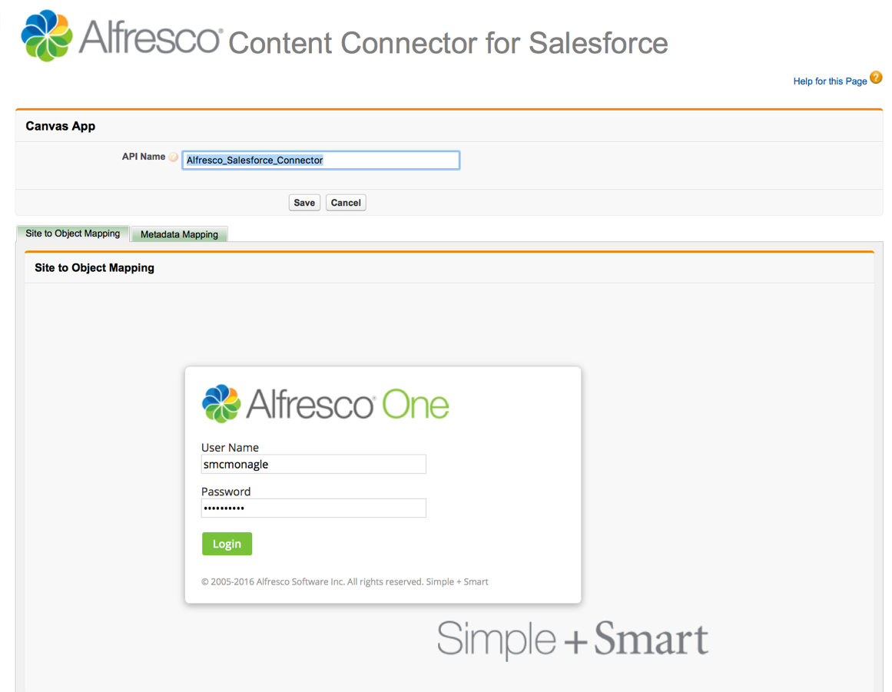
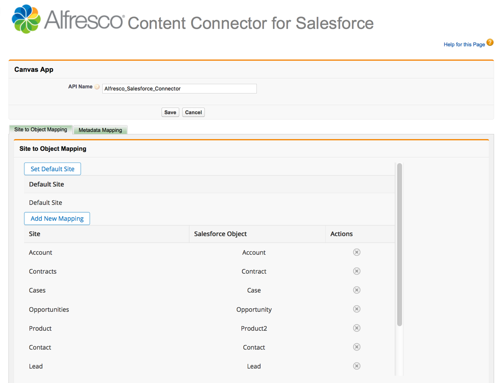

# 5. Alfresco Setup tab: Adding an Alfresco site and mapping metadata in Salesforce

Configure the Alfresco site that you want to point to, and map your metadata.

Make sure that you've downloaded the Alfresco Content Connector app, as described here: [2. Installing the app in Salesforce](salesforce-ent-install-app.md). You need administrator rights to make these changes.

1.  In Salesforce, click Alfresco Content Connector. This is available from the Force.com App Menu.

2.  Click the Alfresco Setup tab and in API Name, enter the API name of the connected app definition you created in [Configuring your app in Salesforce](salesforce-ent-configure.md#step2).

    This sets the Alfresco site that you want to use for Alfresco content. If this is not set up correctly, you'll see an error message. See [Troubleshooting](../concepts/salesforce-troubleshoot.md#8) for guidance.

3.  You'll see two tabs; Site to Object Mapping and Metadata Mapping. Select a tab and you'll see the Alfresco login screen. Log on to your connected Alfresco instance.

    This is a sample screen, before logging on to Alfresco:

    

    The Site to Object Mapping and Metadata Mapping tabs set where Salesforce puts content in Alfresco.

    **Note:** Metadata mapping is available with Alfresco One 5.1 and later versions only.

    It can take a little while for Alfresco to load the first time you first log in, or after an Alfresco server restart.

4.  In Site to Object Mapping:

    1.  Click Set Default Site and choose the site that you want to set as the default entry point for your organization, and Save.

    2.  Click Add New Mapping to specify where content of a specific Salesforce object type should be stored in Alfresco. Pick a site and an object type that maps to that site.

        For example, you can map documents with a Contracts object type to a site that contains only contracts in Alfresco, or you can map sensitive HR data to an HR object type. Your mappings are then displayed in a table.

5.  In Metadata Mapping, choose a Salesforce object and select from the list of associated properties.

    This defines what Salesforce properties or metadata that you want to share with Alfresco. Click OK and a new Salesforce object type is created, with a matching Alfresco model with an associated aspect, and the specified properties. This creates a new model in Alfresco.

    You can enable or disable an object model. If a model is:

    -   Enabled: metadata is synchronized with the Alfresco object model.
    -   Disabled: metadata can't be synchronized with the Alfresco object model.
    **Note:** Models are inactive when they are added to Salesforce, and can be deleted while they are inactive. A model can be explicitly activated and deactivated. A model can be deleted only if it is deactivated and has not been used. If the model has been used and a user attempts to delete it, an error message is issued explaining that it can't removed. For more information about models in Alfresco, see [Model Manager](http://docs.alfresco.com/5.2/concepts/admintools-cmm-intro.html).

    **Note:**

    Do not edit the prefix of a Salesforce model, as this can make your model unusable.

    Here is an example of a completed Alfresco Setup tab:

    

**Parent topic:**[Installing Alfresco Content Connector for Salesforce - Classic](../concepts/salesforce-classic-ent-install-overview.md)

