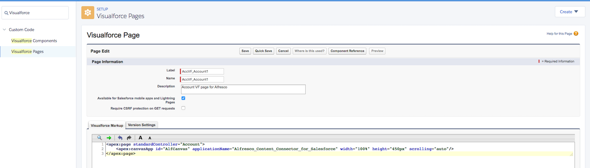

# 6. Adding the Alfresco app in Salesforce

Lastly, you'll need to load the Alfresco canvas app for page layouts. You can add the app to any record type that supports layouts \(for example; Accounts, Cases, and Opportunities\). This is done by setting Alfresco for Salesforce example page layouts as the default for selected user profiles.

Make sure that you've downloaded the Alfresco Content Connector app, as described here: [2. Installing the app in Salesforce](salesforce-ent-install-app.md). You need administrator rights to make these changes.

To create the Visualforce Pages for each object where you want the app to appear, follow these steps:

1.  In your Salesforce account, find Setup. This is accessible by clicking the gear icon, , from the top-right toolbar on the Salesforce page. See [How to find Setup](https://help.salesforce.com/apex/HTViewHelpDoc?id=basics_nav_setup.htm) for more guidance on where to find this.

    From Setup, enter Visualforce Pages in the Quick Find search bar and then select **Visualforce Pages**.

2.  Click **New** to open the Visualforce Page editor.

    1.  Enter a **Label** for the page. The label is displayed where the page appears in the page layout.

    2.  Enter a **Name** for the page.

    3.  Check **Available for Salesforce mobile apps and Lightning Pages**.

        

    4.  Copy and paste the following code in the **Visualforce Markup** editor:

        ```
        <apex:page standardController="{Your Object Name}">
            <apex:canvasApp id="AlfCanvas" applicationName="{Your Connected App API Name}" width="100%" height="450px" scrolling="auto"/>
        </apex:page>
        ```

        **Note:** Replace `{Your Object Name}` with the `sObject` or `custom object API` name where you want the app to appear. For example, `Account`, `Lead`, `Asset`, or `training__c`.

        **Note:** Replace the \{`Your Connected App API Name}` with the API Name you set when creating the Connected App definition. For example, `Alfresco_Content_Connector_for_Salesforce`.

3.  Save your settings.

    Repeat Step 2 and 3 for every object where you want the app to appear.

4.  Now for each Salesforce object where you want the app to appear, you need to add the Visualforce page you just created into the Lightning page layout. To do so, follow these steps:

    1.  For example, if the Salesforce object is `Account`, then on the Salesforce page, click Accounts.

        The ACCOUNTS screen appears listing all the accounts.

    2.  Click the account where you want the Visualforce page to appear.

    3.  Click the gear icon, , from the top-right toolbar on the Salesforce page.

    4.  Click **Edit Page**.

    5.  Select **Visualforce** from the **Standard** components list in the scrollable window.

        You can drag and place the component where you want it on the page.

    6.  Specify a **Label** for the Visualforce page. If no label is specified, the default label of the Visualforce page is used.

    7.  Select the Visualforce page you have created from the **Visualforce Page Name** drop-down list. This field is mandatory.

    8.  Specify a minimum **Height** of 450 pixels.

    9.  Save your settings.

        If you're editing the page for the first, you may need to activate the page if this is the first time you are editing the page.

        It can take a little while for the Alfresco widget to load for the first time.

5.  Open a record that has the new page layout. You should now be able to see an Alfresco section, with a Files tab. You can add files here by dragging and dropping them, or by using the Upload button.

    You can also add new folders with the Create button. Equally, any files added in Alfresco can be seen in this window. This content is stored directly in Alfresco and can be viewed either in Salesforce, or in your usual Alfresco site.


**Parent topic:**[Installing Alfresco Content Connector for Salesforce - Lightning Experience](../concepts/salesforce-ent-install-overview.md)

