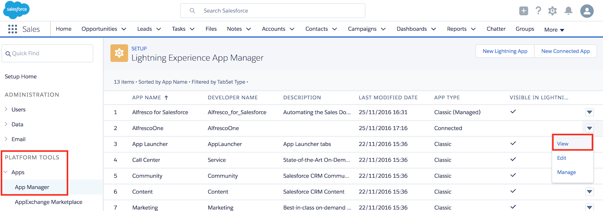
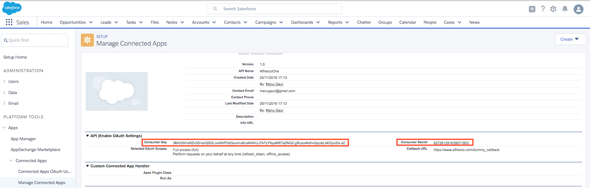
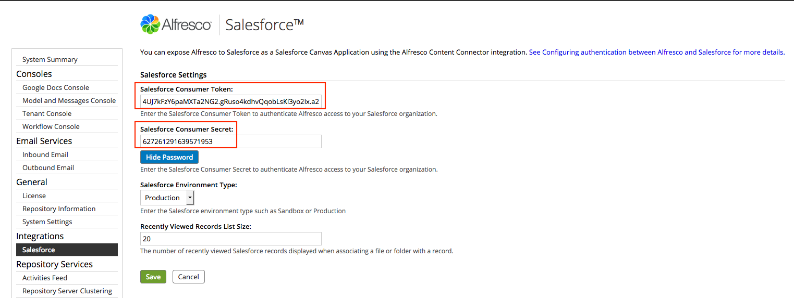

# 4. Enabling Salesforce in the Alfresco Admin Console

You'll need to copy the Salesforce consumer key and consumer secret from your connected app into the Alfresco Admin Console. These credentials prove that Alfresco has permission to be displayed in and communicate with Salesforce.

Make sure that you've applied your AMP files, downloaded the Alfresco Content Connector app, and created a connected app, as described in the previous topics. You need administrator rights to make these changes.

1.  In your Salesforce account, click the gear icon, , from the top-right toolbar on the Salesforce page, and click **Setup Home**.

2.  Under PLATFORM TOOLS, click Apps \> App Manager.

3.  On the Lightning Experience App Manager screen, click the down-arrow icon for the app that you created in [3. Configuring your app in Salesforce](salesforce-ent-configure.md) and select View.

    

    In the API \(Enable OAuth Settings\) section, you'll see entries for the consumer key and consumer secret.

4.  Copy the code in the Consumer Key field.

5.  In a separate browser window, log on to the Salesforce page of the Alfresco Admin Console with your administrator credentials:

    ```
    http://localhost:8080/alfresco/service/enterprise/admin/admin-salesforce
    ```

    where localhost:8080 is your Alfresco host name and port.

6.  In the Admin Console window, paste your Salesforce consumer key into Salesforce Consumer Token.

7.  In the Salesforce window, click Click to reveal to reveal the consumer secret, and copy the code.

    

8.  Paste your Salesforce consumer secret into Salesforce Consumer Secret.

    You can optionally hide the password when you have pasted it into the Admin Console.

9.  Select the Salesforce Environment Type that Alfresco should use. There are two options: Production \(the default value\) and Sandbox.

    

10. You can optionally change the list size of records that are displayed.

    Enter a number in Recently Viewed Records List Size to specify how many recent Salesforce records are displayed when you link an Alfresco file or folder with a record. The default setting is 20 records.

    **Note:** Alternatively, you can set this in your alfresco-global.properties file using sfdc.canvas.recordMruSize. For example:

    ```
    sfdc.canvas.recordMruSize=10
    ```

11. Save your settings.


**Parent topic:**[Installing Alfresco Content Connector for Salesforce - Lightning Experience](../concepts/salesforce-ent-install-overview.md)

