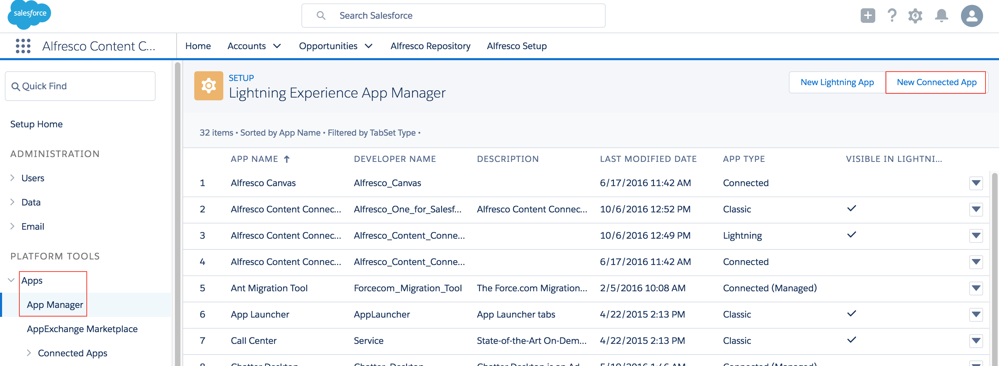

# 3. Configuring your app in Salesforce

After you've installed the app, create a new connected app definition using the Salesforce Setup menu.

Make sure that you've downloaded the Alfresco Content Connector app, as described here: [Installing the app in Salesforce](salesforce-ent-install-app.md). In this task, you'll use the Setup menu in Salesforce to customize the install. You need administrator rights to make these changes.

1.  In your Salesforce account, find Setup. This is accessible by clicking the gear icon, , from the top-right toolbar on the Salesforce page. See [How to find Setup](https://help.salesforce.com/apex/HTViewHelpDoc?id=basics_nav_setup.htm) for more guidance on where to find this.

    Search for Apps in the Quick Find search bar, and click App Manager to see your installed apps.

2.  Click New Connected App to create a new connected app.

    

    This new app extends the standard connector to work for your organization. Use the following settings:

    1.  Connected App Name: Name your app something memorable and unique; for example, Alfresco On-Premise
    2.  API Name: Choose a meaningful name. This is the name used by the API and managed packages.

        **Note:** The default is Alfresco\_Content\_Connector\_for\_Salesforce. You'll need to remember the API Name when you configure the Alfresco Setup tab.

        **Note:** If this is not set up correctly, you'll see an error message. See [Troubleshooting](../concepts/salesforce-troubleshoot.md#8) for guidance.

    3.  Contact Email: Enter an administrator email address.
    4.  Check Enable OAuth Settings.
    5.  Callback URL: this field is not used, but does need to be completed. You can set this to https://www.alfresco.com/dummy\_callback.
    6.  In Selected OAuth Scopes add the following scopes:
        -   Full access \(full\)
        -   Perform requests on your behalf at any time \(refresh\_token, offline\_access\)
    7.  Check Force.com Canvas.
    8.  In Canvas App URL, enter a secure \(https\) URL that points to the Alfresco Share environment, that you have configured with the Alfresco Content Connector. You also need a suffix of share/page/sfdc/canvas/signedrequest. For example:

        ```
        https://localhost:8443/share/page/sfdc/canvas/signedrequest
        ```

    9.  Access Method: Select Signed Request \(POST\)
    10. Add these Locations:

        -   Chatter Tab
        -   Layouts and Mobile Cards
        -   Lightning Component
        -   Visualforce Page
        These are locations in Salesforce where the canvas app can be displayed.

    11. In Lifecycle Class, look up the options and select AlfrescoCanvasLifeCycleHandler.
    12. Click Save to save your settings.
    Next, you’ll need to manage the connected app that you have just created.

3.  For the new connected app, click Manage to set permissions and accessibility.

4.  In the OAuth policies section, enter these values:

    1.  Permitted Users: Select Admin approved users are pre-authorized.

        Click OK to accept the Salesforce message.

    2.  IP Relaxation: Select Enforce IP restrictions.

    3.  Refresh Token Policy: Select the Refresh token is valid until revoked radio button.

    4.  Save your settings.

5.  In the Manage Profiles section, click Manage Profiles, check the required profiles, and Save your settings.

    For example, select System Administrator and Standard User. We will now find the consumer secret ready to paste into Alfresco.


**Parent topic:**[Installing Alfresco Content Connector for Salesforce - Lightning Experience](../concepts/salesforce-ent-install-overview.md)

