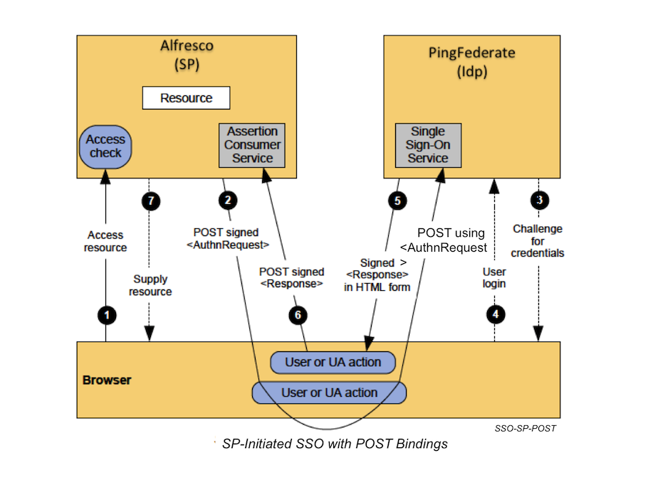

# SAML Single Sign-On \(SSO\) for Alfresco Content Services 1.0.3

You can use Security Assertion Markup Language \(SAML\) with Alfresco to support Single Sign-On \(SSO\) across an organization.

SAML standards define an XML-based framework for describing and exchanging security information between an identity provider \(IdP\) and service provider \(SP\).

Security information is expressed in the form of portable SAML assertions that applications working across security boundaries can trust.

Alfresco Share uses Web Browser SSO and Single-Logout \(SLO\) profiles, using the HTTP Post Binding only.

SAML is based on a trust relationship between an IdP \(for example, PingFederate or AD FS\) and an SP \(for example, Alfresco Share\) who agree to share authentication information; for example, metadata and configuration information that is required to access services.

Alfresco uses SAML 2.0. See [OASIS SAML v2.0](https://wiki.oasis-open.org/security/FrontPage) for more information on SAML specifications.

This diagram explains the exchange of information between the service provider \(in this case, Alfresco Share\), and the identity provider \(in this case, PingFederate\):

-   **[Installing SAML SSO in Alfresco](../concepts/saml-config-overview.md)**  
Use this information to set up SAML with Alfresco.
-   **[Configuring SAML SSO](../tasks/saml-config.md)**  
Use this information to configure SAML SSO between Alfresco and your identity provider.
-   **[SAML SSO REST API service provider usage guidelines](../concepts/develop-saml.md)**  
This information is intended for developers or system administrator to create applications that interact with Alfresco.
-   **[SAML known issues and workarounds](../concepts/saml-known-issues.md)**  
Use this information for identifying any known issues while using SAML SSO in Alfresco and its workaround.
-   **[Troubleshooting SAML SSO](../concepts/saml-troubleshoot.md)**  
Use this information to troubleshoot common SAML SSO issues.
-   **[Copyright](../reuse/copyright.md)**  

-   **[Disclaimer](../reuse/disclaimer.md)**  

