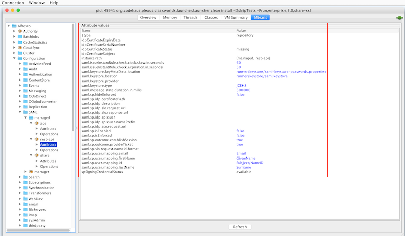

# Configuring SAML SSO settings for REST API using JMX beans

Use this information to configure SAML SSO setting for REST API using JMX beans. The SAML SSO beans are described here with their default values.

Example values are given. Always check the values in our own system as these can vary depending on the install method or operating system.

CAUTION:

Be aware that any changes you make to attributes in the live system are written to the database. The next time that Alfresco starts, these values will take precedence over any values specified in properties files.

**Alfresco:Type=Configuration, Category=SAML, Object Type=SAML$managed$rest-api**

|Attribute name|Example value|
|--------------|-------------|
|$type|`repository`|
|idpCertificateExpiryDate| |
|idpCertificateSerialNumber| |
|idpCertificateStatus|`missing`|
|idpCertificateSubject| |
|instancePath|`[managed, rest-api]`|
|saml.issueInstantRule.check.clock.skew.in.seconds|`60`|
|saml.issueInstantRule.check.expiration.in.seconds|`30`|
|saml.keystore.keyMetaData.location|`classpath:alfresco/keystore/saml-keystore-passwords.properties`|
|saml.keystore.location|`classpath:alfresco/keystore/saml.keystore`|
|saml.keystore.provider| |
|saml.keystore.type|`JCEKS`|
|saml.message.state.duration.in.millis|`300000`|
|saml.sp.hideEnforced|`false`|
|saml.sp.idp.certificatePath|Set the path to the certificate you require|
|saml.sp.idp.slo.request.url| |
|saml.sp.idp.slo.response.url| |
|saml.sp.idp.spIssuer| |
|saml.sp.idp.spIssuer.namePrefix| |
|saml.sp.idp.sso.request.url| |
|saml.sp.isEnabled|`false`|
|saml.sp.isEnforced|`false`|
|saml.sp.outcome.establishSession|`true`|
|saml.sp.outcome.provideTicket|`true`|
|saml.sp.idp.description|`<Identity Provider>`|
|saml.sp.user.mapping.email|`Email`|
|saml.sp.user.mapping.firstName|`GivenName`|
|saml.sp.user.mapping.id|`Subject/NameID`|
|saml.sp.user.mapping.lastName|`Surname`|
|spSigningCredentialStatus|`missing`|
|saml.sp.slo.request.nameid.format| |

**Alfresco:Type=Configuration, Category=SAML, Object Type=SAML$manager**

|Attribute name|Example value|
|--------------|-------------|
|chain|`share:share,rest-api:repository,aos:repository`|

For the complete list of Alfresco MBeans, see [JMX bean categories reference](http://docs.alfresco.com/5.1/concepts/jmx-reference.html).

**Parent topic:**[Configuring SAML SSO for REST API](../concepts/config-saml-restapi.md)

