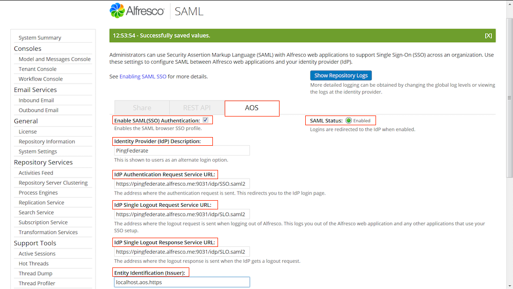
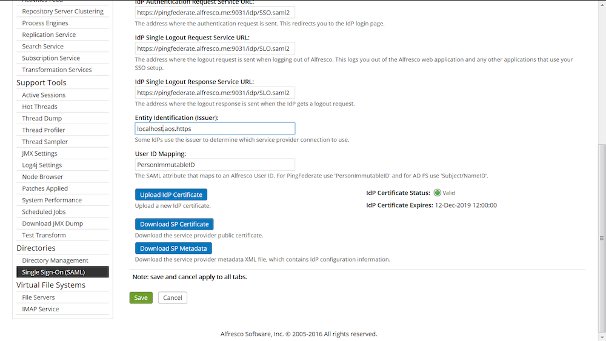

# Configuring SAML SSO settings for AOS using the Admin Console

Administrators can enable and configure SAML SSO authentication using the Alfresco Admin Console.

1.  Log in to the SAML SSO page of the Alfresco Admin Console with your user credentials: http://localhost:8080/alfresco/service/enterprise/admin/admin-saml

    where localhost:8080 is your Alfresco host name and port.

2.  Select the AOS tab.

3.  Select **Enable SAML \(SSO\) Authentication**.

    SAML Status shows whether SAML is currently enabled or disabled.

4.  Specify the **Identity Provider \(IdP\) Description**.

    

5.  Enter the IdP settings:

    -   IdP Authentication Request Service URL: The address where the authentication request is sent. This redirects you to the identity provider login page.
    -   IdP Single Logout Request Service URL: The address where the logout request is sent when logging out of Alfresco. This logs you out of Alfresco and any other applications that use your SSO setup.
    -   IdP Single Logout Response Service URL: The address where the logout response is sent when the identity provider gets a logout request.
    -   Entity Identification \(Issuer\): Some IdPs use the issuer to determine which service provider connection to use. If you are using AD FS, this is the Base URL \(http://localhost:8080/share where localhost:8080 is your Alfresco host name and port\).
    -   User ID Mapping: The SAML attribute that maps to an Alfresco User ID. For PingFederate, this maps to `PersonImmutableID`. For AD FS, the SAML attribute is the `Subject/NameID` specified for the SAML subject `NameID`.
6.  Click **Upload IdP Certificate** to browse to and upload the IdP certificate that you downloaded from your IdP in [Exporting your IdP certificate](saml-config-cert.md).

    IdP Certificate Status shows whether the certificate is valid, and IdP Certificate Status shows the expiry date of the current certificate.

    Alfresco does not allow you to upload an expired certificate. If you attempt to do this, you will see an error message.

    **Note:** If SAML is enabled, Alfresco always checks for a existing certificate.

    

7.  Click **Download SP Certificate** to download the certificate required by your IdP.

    This is a copy of your self-signed certificate. You already downloaded this information when setting up your connections in the IdP here: [Configuring PingFederate manually](saml-pingfederate.md#step7).

8.  Click **Download SP Metadata** if you need to download the service provider signature verification certificate.

    This is required for AD FS configuration, if you are using AD FS as your IdP.

9.  Click **Save**.

You have configured the SAML SSO settings. You can disable these settings by deselecting **Enable SAML \(SSO\) Authentication**.

Next, configure your IdP with the SAML SSO settings. See [Configuring PingFederate manually](saml-pingfederate.md) for more information.

**Parent topic:**[Configuring SAML SSO for AOS](../concepts/config-saml-aos.md)

