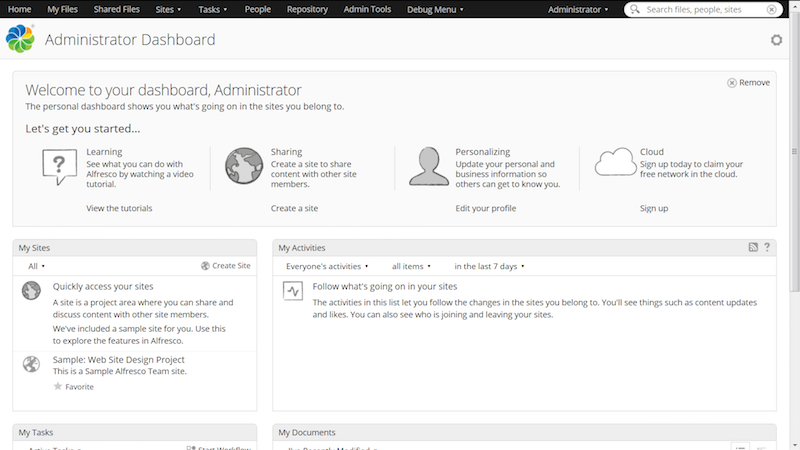

# Authenticating users with SAML SSO for AOS

After configuring SAML SSO in Alfresco for AOS, you can test that everything is set up correctly.

1.  Verify that the administrator email address is configured correctly in the IdP.

2.  Login to Share as the administrator.

    http://localhost:8080/share

    where localhost:8080 is your Alfresco host name and port.

    You should get redirected to the IdP - PingFederate or AD FS.

    

3.  Enter your user credentials in the IdP page.

    

    You should get redirected to Share.

4.  For a given site, go to the Document Library.

5.  Hover over a file you want to edit and click **More** then **Edit in Microsoft Office**.

6.  The MS Office file opens the IdP login page in a separate window.

7.  Enter your user credentials.

8.  The file is now open and you can edit it, as needed.

9.  Additionally, you can also map the AOS network drive in the Windows Explorer. You will be presented with a repository to browse.

10. Log out of Share \(as the administrator\).

    If you go back to your IdP page, you should also be logged out.

    Once you logout from Share, you can't access the recent history in the MS Office file. Also, you will not be able to map the AOS network drive.

**Parent topic:**[Configuring SAML SSO for AOS](../concepts/config-saml-aos.md)

