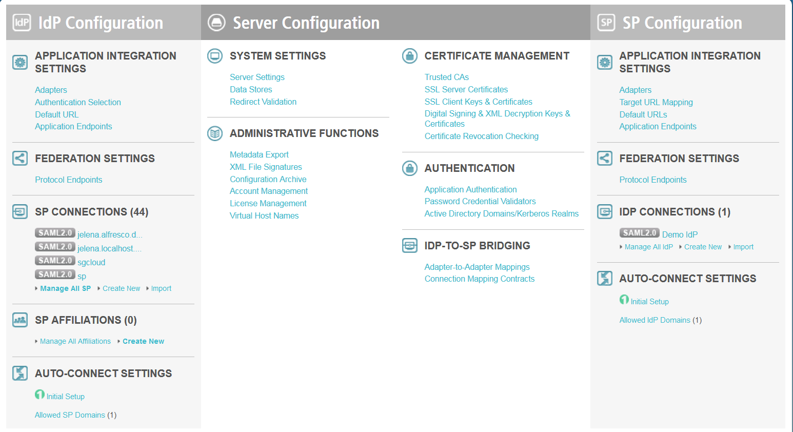
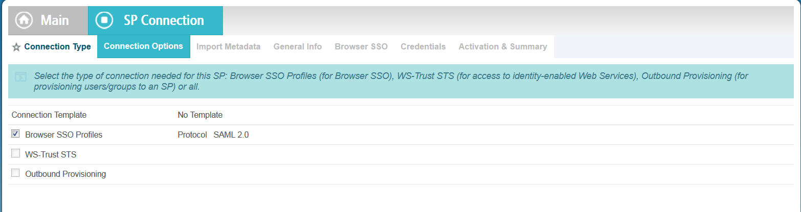
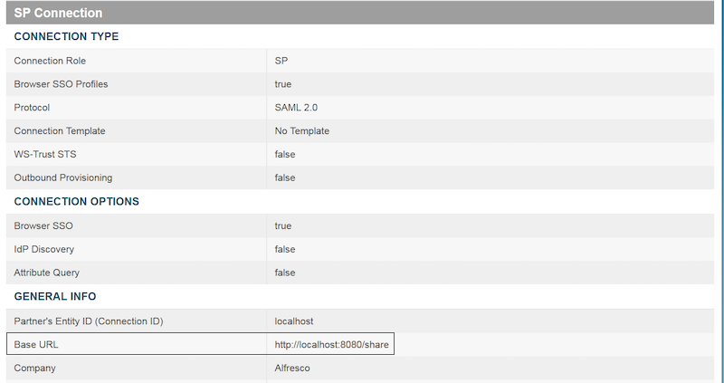
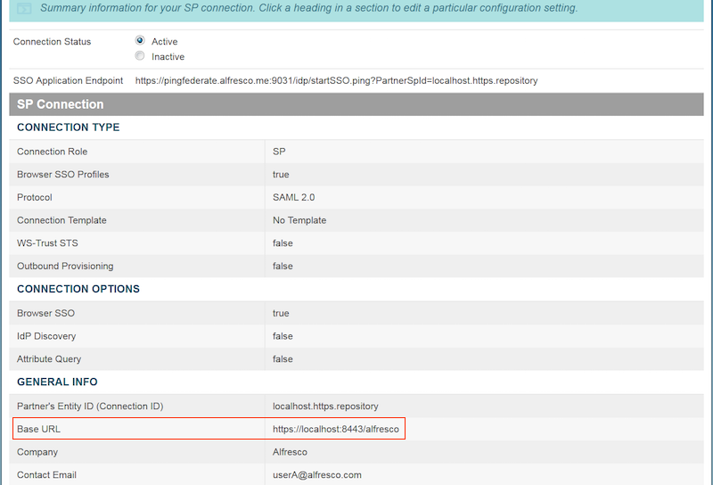
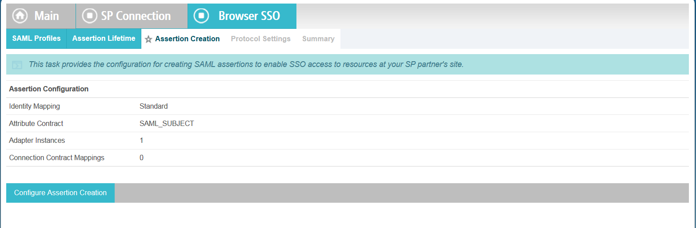
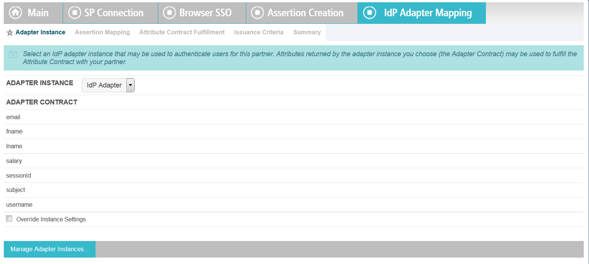
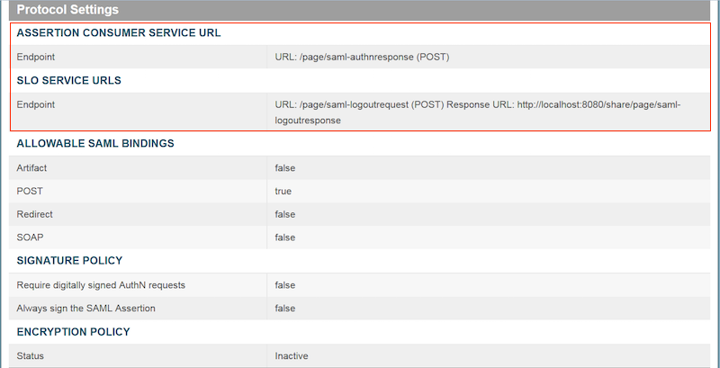
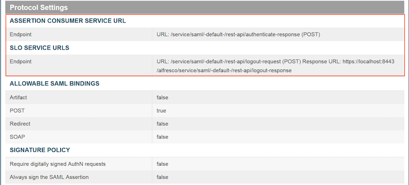
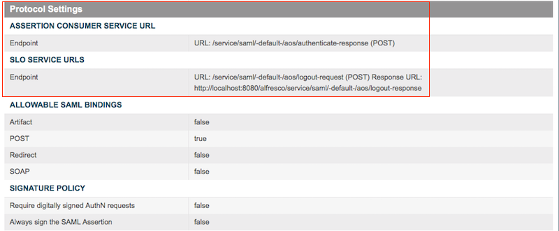
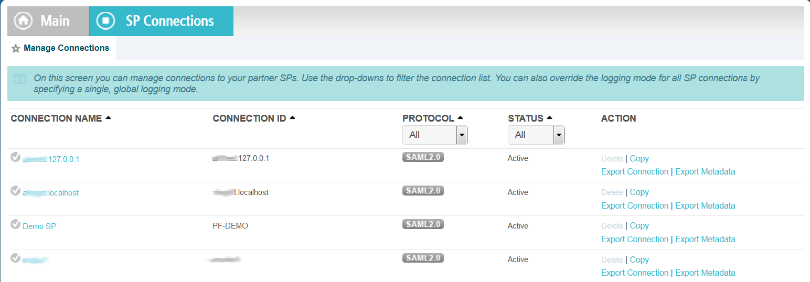

# Configuring PingFederate manually

Configure your PingFederate identity provider manually to work with SAML SSO in Alfresco.

**Note:** The following steps are example instructions to help you configure PingFederate. For detailed configuration information see the [PingFederate admin documentation](https://documentation.pingidentity.com/pingfederate/pf81/index.shtml#gettingStartedGuide/concept/consoleNavigation.html).

If you have an existing PingFederate connection that you want to edit and reuse for Alfresco, see [Configuring PingFederate using a cloned connection](saml-pingfederate-import.md).

1.  Log in to your PingFederate administrative console as the administrator.

    The URL is in the format:

    ```
    https://<DNS_NAME>:9999/pingfederate/app
    ```

    where `<DNS_NAME>` is the fully qualified name of the machine running the PingFederate server.

    Three sections are displayed: IdP Configuration, Server Configuration, and SP Configuration. We will be working with the IdP Configuration section.

    

2.  In **IdP Configuration** \> **SP Connections**, click **Create New** to create your service provider connection \(in this instance, Alfresco is your service provider\).

3.  Enter information in each of the following tabs to set the type of connection you want to establish between PingFederate and Alfresco.

    These are the tabs you will see when you click **Create New**:

    

    1.  **Connection Type**: Select the **Browser SSO Profiles** check box and click **Next**.

    2.  **Connection Options**: Select the **Browser SSO** check box and click **Next**.

    3.  **Import Metadata**: Use this tab to import metadata file from Alfresco SP describing this new connection.

        1.  In a new browser window, log in to the Admin Console SAML SSO page as an administrator:

            ```
            http://localhost:8080/alfresco/service/enterprise/admin/admin-saml
            ```

            where localhost:8080 is your Alfresco host name and port.

        2.  Click Download SP Metadata.
        3.  Save the file.

            **Note:** You'll set up the Admin Console settings for SAML in a later task, but we need this metadata file to share information about Alfresco.

    4.  Set these values in the **General Info** tab:

        1.  Specify the Partner's Entity ID \(Connection ID\) and the Connection Name for your connection.
        2.  Ensure that the Base URL is pointing to your service provider. For example:
            -   **If you are using Alfresco Share:**

                ```
                http://localhost:8080/share
                ```

                

            -   **If you are using REST API or AOS:**

                ```
                http://localhost:8080/alfresco
                ```

                

        3.  Optionally, you can also provide contact information.
        4.  Set the level of transaction logging you need for Alfresco. Ensure that Standard is selected as the Logging Mode.
        5.  Click **Next**.

            **Note:** You can save the configuration by clicking **Save Draft**. You can then retrieve it by selecting Manage All SP from SP Connections on the main administrative console page.

        6.  The Browser SSO tab has a number of sections to complete. Click **Configure Browser SSO** and complete the following steps on each of the Browser SSO tabs.
4.  Use the Browser SSO section to setup message transfers between Alfresco and PingFederate.

    1.  Select all four available profiles on this tab and click **Next**.

        **SAML Profiles**: Alfresco uses all the SSO and SLO profiles available.

    2.  **Assertion Lifetime**: Accept the default and click **Next**.

        This sets the time for which an assertion is valid. A SAML assertion is an XML document that contains authentication, authorization, and attribute information. Each assertion has validity time period.

    3.  Click **Configure Assertion Creation** in the **Assertion Creation** tab.

        Configuring assertions involves specifying how PingFederate obtains user-authentication information and uses it to create assertions for Alfresco. This includes choosing an identity mapping method, defining the attribute contract for Alfresco and configuring adapters.

        

    4.  **Identity Mapping**: Ensure that the **Standard** mapping is selected and click **Next**.

    5.  Enter the following information for the **Attribute Contract**:

        1.  Choose **urn:oasis:names:tc:SAML:1.1:nameid-format:unspecified** as the subject name format for the SAML\_SUBJECT attribute contract.

            **Note:** The contract includes the default SAML\_SUBJECT, which identifies the user in the assertion. This is because you used the standard identity mapping.

        2.  Extend the Contract by adding an email part to it. Type **Email** in the **Extend the Contract** text box.
        3.  Choose **urn:oasis:names:tc:SAML:2.0:attrname-format:basic** as the attribute name format and click **Add**. The details are added.
        4.  Click **Next**.
5.  In Authentication Source Mapping, click **Map New Adapter Instance**, and complete the following steps for the **IdP Adapter Mapping** tabs.

    IdP adapters are used for user authentication in the Single Sign-On process. When an Alfresco user enters credentials, the user attributes are returned to PingFederate.

    1.  **Adapter Instance**: Select **IdP Adapter** from the **Adapter Instance** menu and click **Next**.

        An adapter instance is a configured and deployed adapter.

    2.  **Assertion Mapping**: Ensure **Use only Adapter Contract values in the SAML assertion** is selected. Click **Next**.

        Setting up assertion mappings involves defining data stores that you want to use to look up adapter contract values.

    3.  Set these values for **Attribute Contract Fulfilment**:

        1.  For the Email attribute contract, select **Adapter** as the **Source**.
        2.  For the Email attribute contract, select **email** as the **Value**.
        3.  For the SAML\_SUBJECT attribute contract, select **Adapter** as the **Source**.
        4.  For the SAML\_SUBJECT attribute contract, select **subject** as the **Value** .
        5.  Click **Next**.
    4.  Click through **Next** and **Done**, as the information is optional for the **Issuance Criteria** tab.

    5.  Click **Next** and **Done**.

        You are redirected to the Browser SSO tab to configure bindings, endpoints, and other settings needed for the SAML profile.

        **Note:** You can save the configuration at any time by clicking Save Draft. You can then retrieve it by selecting Manage All SP from SP Connections on the main administrative console page.

6.  Click **Protocol Settings** in the **Browser SSO** tab and complete the following tasks on each of the **Protocol Settings** tabs.

    1.  Specify information for the **Assertion Consumer Service URL**:

        **For Share:**

        1.  Select **POST** from the **Binding** menu.
        2.  Type **/page/saml-authnresponse \(POST\)** in the **Endpoint URL** field.
        3.  Click **Add**. Click **Next**.
        

        **For REST API:**

        1.  Select **POST** from the **Binding** menu.
        2.  Type **/service/saml/-default-/rest-api/authenticate-response \(POST\)** in the **Endpoint URL** field.
        3.  Click **Add**. Click **Next**.
        

        **For AOS:**

        1.  Select **POST** from the **Binding** menu.
        2.  Type **/service/saml/-default-/aos/authenticate-response \(POST\)** in the **Endpoint URL** field.
        3.  Click **Add**. Click **Next**.

            

    2.  Specify information for the **SLO Service URLs**. These specify where Alfresco receives logout requests when a Single Log-out \(SLO\) request is initiated by PingFederate, and where PingFederate sends SLO responses.

        **For Share:**

        1.  Select **POST** from the **Binding** menu.
        2.  Type **/page/saml-logoutrequest** in the **Endpoint URL** field.
        3.  Type **https://-your server-/share/page/saml-logoutresponse** in the **Response URL** field.

            For example:

            ```
            https://localhost:8443/share/page/saml-logoutresponse
            ```

        4.  Click **Add**. Click **Next**.
        **For REST API:**

        1.  Select **POST** from the **Binding** menu.
        2.  Type **/service/saml/-default-/rest-api/logout-request \(POST\)** in the **Endpoint URL** field.
        3.  Type **https://-your server-/alfresco/service/saml/-default-/rest-api/logout-response** in the **Response URL** field.
        **For AOS:**

        1.  Select **POST** from the **Binding** menu.
        2.  Type **/service/saml/-default-/aos/logout-request \(POST\)** in the **Endpoint URL** field.
        3.  Type **https://-your server-/alfresco/service/saml/-default-/aos/logout-response** in the **Response URL** field.
    3.  **Allowable SAML Bindings**: Ensure that only **POST** is selected as the binding type. Click **Next**.

    4.  **Signature Policy**: You do not need to select an option; just click **Next**.

    5.  Configure the **Encryption Policy**:

        1.  Ensure that **None** is selected and click **Next**.
        2.  Check the summary and click **Done**.
        3.  Click **Next**.
        4.  Review the final settings and click **Done**. You are redirected to the SP Connection \> Browser SSO tab.
7.  Click the **Credentials** tab and **Configure Credentials** and complete the following steps on each tab.

    1.  **Digital Signature Settings**: Download the PingFederate certificate.

        In the Credentials section, select **Digital Signature Settings** and Manage Certificates.

        1.  Click **Export** for the IdP certificate that you require.
        2.  Select **Certificate only** and click **Next**.
        3.  Click **Export**, and save the file to a folder. Click **Done**.
        You'll need this certificate for uploading to Alfresco in [Configuring SAML SSO settings for Share using the Admin Console](saml-config-console.md).

        On the **Digital Signature Settings** screen, select the signing certificate and the signing algorithm.

        1.  Select the certificate from the drop-down list.
        2.  Select the Signing Algorithm from the drop-down list. Make sure that the selected Signing Algorithm is **RSA SHA256**.
    2.  **Signature Verification Settings**: Specify the SP Certificate used by PingFederate to validate Alfresco SAML messages.

        1.  Select Manage Signature Verification Settings.
        2.  Select the **Unanchored** option.
        3.  Click **Next**.
        4.  Click **Manage Certificates**.
        5.  Click **Import** and **Browse** to select the SP Certificate that you downloaded from Alfresco and then click **Extract**.
        6.  In a new browser window, log in to the Admin Console SAML SSO page as an administrator.

            ```
            http://localhost:8080/alfresco/service/enterprise/admin/admin-saml
            ```

            where `localhost:8080` is your Alfresco host name and port.

        7.  Click **Download SP Certificate**.
        8.  Save the file.
        9.  Click **Next**. The **Summary** screen is displayed. You can review or edit your credentials configuration here.
        10. When you finish editing the existing settings, click **Done** on the **Summary** screen, and **Save** on the  **Credentials** screen.
8.  Ensure that your connection is active.

    You can check your connection from the main administrative console. Select SP Connections \> Manage All SP and scroll down to see the connection you created. Each connection has a status of Active, Inactive or Draft.

    


-   **[Configuring PingFederate using a cloned connection](../tasks/saml-pingfederate-import.md)**  
Import a connection into the PingFederate identity provider to work with SAML SSO in Alfresco.
-   **[Creating PingFederate users in a development environment](../tasks/saml-setup-users-dev.md)**  
This task explains how to create users in PingFederate for a test setup.
-   **[Exporting your IdP certificate](../tasks/saml-config-cert.md)**  
Download a certificate from the IdP to set up SAML SSO in Alfresco.

**Parent topic:**[Step 1. Configuring the identity provider](../concepts/config-IdP.md)

