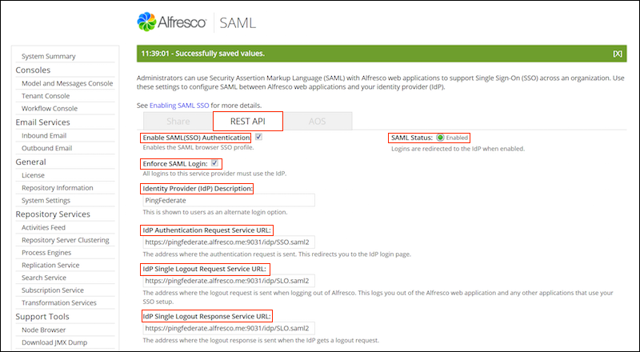

# Configuring SAML SSO settings for REST API using the Admin Console

Administrators can enable and configure SAML SSO authentication for REST API using the Alfresco Admin Console.

**Important:** If you want to enable and enforce SAML SSO for REST API, all applications using the REST API \(like Share\) will use SAML as well. Therefore, you must enable and enforce SAML for Share. The enforce option is ignored if SAML is disabled for the REST API.

1.  Log on to the SAML SSO page of the Alfresco Admin Console with your user credentials: http://localhost:8080/alfresco/service/enterprise/admin/admin-saml

    where localhost:8080 is your Alfresco host name and port.

2.  Select the REST API tab.

3.  Select **Enable SAML \(SSO\) Authentication**.

    SAML Status shows whether SAML is currently enabled or disabled.

4.  \(Optional\) Select **Enforce SAML Login**.

    If this option is selected by default then all logins to this service provider must use the Identity Provider \(IdP\). If you do not enforce the SAML login, the user can decide to use either the Alfresco login or login using the IdP link.

5.  Specify the **Identity Provider \(IdP\) Description**.

    This description is shown to users as an alternate login option when **Enforce SAML Login** is deactivated. If no description is provided, the text displayed on the Alfresco login screen would read **your single sign-on provider**. Clicking on this description will redirect you to the IdP.

    

6.  Enter the IdP settings:

    -   IdP Authentication Request Service URL: The address where the authentication request is sent. This redirects you to the identity provider login page.
    -   IdP Single Logout Request Service URL: The address where the logout request is sent when logging out of Alfresco. This logs you out of Alfresco and any other applications that use your SSO setup.
    -   IdP Single Logout Response Service URL: The address where the logout response is sent when the identity provider gets a logout request.
    -   Entity Identification \(Issuer\): Some IdPs use the issuer to determine which service provider connection to use. If you are using AD FS, this is the Base URL \(http://localhost:8080/alfresco where localhost:8080 is your Alfresco host name and port\).
    -   User ID Mapping: The SAML attribute that maps to an Alfresco User ID. For PingFederate, this maps to `PersonImmutableID`. For AD FS, the SAML attribute is the `Subject/NameID` specified for the SAML subject `NameID`.
7.  Click **Upload IdP Certificate** to browse to and upload the IdP certificate that you downloaded from your IdP in [Exporting your IdP certificate](saml-config-cert.md).

    IdP Certificate Status shows whether the certificate is valid, and IdP Certificate Status shows the expiry date of the current certificate.

    Alfresco does not allow you to upload an expired certificate. If you attempt to do this, you will see an error message.

    **Note:** If SAML is enabled, Alfresco always checks for a existing certificate.

8.  Click **Download SP Certificate** to download the certificate required by your IdP.

    This is a copy of your self-signed certificate. You already downloaded this information when setting up your connections in the IdP here: [Configuring PingFederate manually](saml-pingfederate.md#step7).

9.  Click **Download SP Metadata** if you need to download the service provider signature verification certificate.

    This is required for AD FS configuration, if you are using AD FS as your IdP.

10. Click **Save**.


You have configured the SAML SSO settings. You can disable these settings by deselecting **Enable SAML \(SSO\) Authentication**.

If you want to check if SAML SSO is enabled \(or enforced\) in your Alfresco server, make a call to:

```
http://localhost:8080/alfresco/service/saml/-default-/rest-api/enabled
```

where:

-   `-default-` is the tenant name
-   `rest-api` is the id of our SAML REST API SP

This will return a JSON response with the information about the REST API SP:

```
{
    "entry":
    { 
      "isSamlEnabled": true,
      "isSamlEnforced": true,
      "idpDescription": ".....",
      "tenantDomain": "...."
    }
}
```

Next, configure your IdP with the SAML SSO settings. See [Configuring PingFederate manually](saml-pingfederate.md) for more information.

**Important:** The Alfresco SAML SSO module when enforcing the REST API Service Provider, will reject any calls \(`GET` or `POST`\) to all the web scripts \(`REST` calls\) that could be used to authenticate into the repository. The only way to get a valid authentication ticket is to do the SAML dance with the IdP or if you are an administrator, you can still access the Admin console with your credentials.

**Parent topic:**[Configuring SAML SSO for REST API](../concepts/config-saml-restapi.md)

