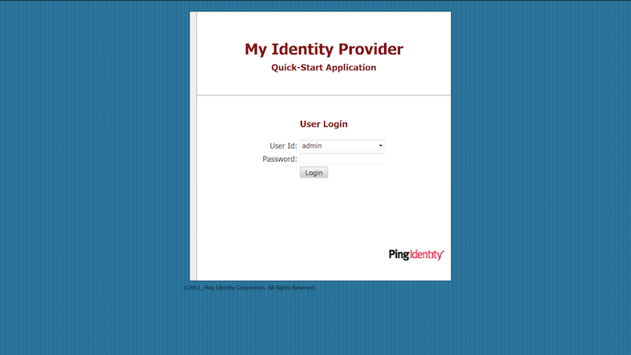
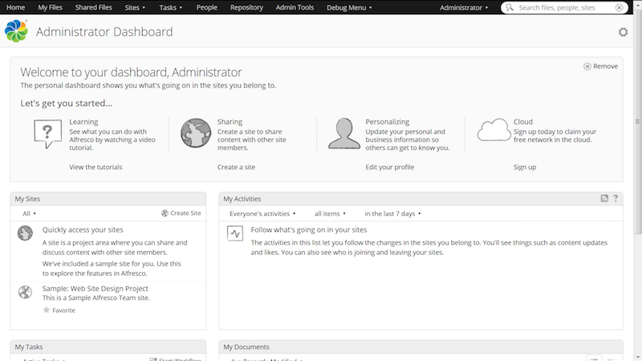

# Authenticating users with SAML SSO for Share

After configuring SAML SSO in Alfresco for Share, you can test that everything is set up correctly.

1.  Verify that the administrator email address is configured correctly in the IdP.

2.  Login to Share as the administrator.

    http://localhost:8080/share

    where localhost:8080 is your Alfresco host name and port.

    You should get redirected to the IdP - PingFederate or AD FS.

    

3.  Enter your user credentials in the IdP page.

    

    You should get redirected to Share.

4.  Log out of Share \(as the administrator\).

    If you go back to your IdP page, you should also be logged out.

**Parent topic:**[Configuring SAML SSO for Share](../concepts/config-saml-share.md)

