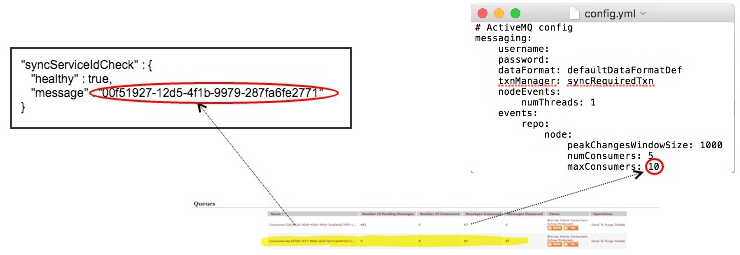

# Monitoring Desktop Sync

Use this information to manage and monitor various aspects of Desktop Sync.

There are a number of areas that can be monitored, including:

-   the ActiveMQ topic that is used to relay events from the repository to the synchronization service.
-   the health of the synchronization service.

The health of the topic can be monitored using JMX and ActiveMQ advisories.

**JMX**

Make sure that JMX is enabled in ActiveMQ. For more information, see [ActiveMQ - JMX](http://activemq.apache.org/jmx.html).

ActiveMQ provides a publish/subscribe mechanism to relay node events from the repository to the synchronization service. The JMX beans that exposes information on the node events topic is:

```
org.apache.activemq:type=Broker,brokerName=localhost,destinationType=Topic,
destinationName=VirtualTopic.alfresco.repo.events.nodes
```

The synchronization service consumes from a queue that is tied to the virtual topic. The JMX bean name of this queue is:

```
org.apache.activemq:type=Broker,brokerName=localhost,destinationType=Queue,
destinationName=Consumer.<SyncId>.VirtualTopic.alfresco.repo.events.nodes
```

where <SyncId\> is a UUID that uniquely represents the synchronization service. This UUID can be obtained from the [synchronization service health check](desktop-sync-monitor.md#healthcheck).

**Configure and Monitor Advisories**

ActiveMQ supports advisory messages or advisories which are added to a standard topic when something happens in ActiveMQ, for example, when a message is consumed or if a message is discarded.

Advisories can be read like any other topic. The following advisories can be useful to monitor:

-   `sendAdvisoryIfNoConsumers` \(For the node events, this advisory is not sent because events are persistent\)
-   `advisoryForSlowConsumers`
-   `advisdoryForFastProducers`
-   `advisoryForDiscardingMessages`
-   `advisoryWhenFull`

The advisories can be configured in the activemq.xml file as follows:

```
<policyEntry topic="VirtualTopic.alfresco.repo.events.nodes" advisoryForDelivery="true" 
advisoryForConsumed="true" advisoryForSlowConsumers="true" sendAdvisoryIfNoConsumers="true" 
advisoryForFastProducers="true">
```

For more information, see [Handling Advisory Messages](http://activemq.apache.org/cms/handling-advisory-messages.html).

**Synchronization service health check**

The synchronization service exposes a collection of health checks that are useful in managing the synchronization service. The health checks include the status of the synchronization service's ActiveMQ, database, and repository connections.

The synchronization service health check can be accessed using JMX \(bean `health`\) or a REST call:

```
GET https://localhost:9090/alfresco/healthcheck
```

The output is something like:

```
{
  "versionCheck" : {
    "healthy" : true,
    "message" : "1.1-SNAPSHOT (2016-03-09T11:12:52Z)"
 },
   "eventsHealthCheck" : {
    "healthy" : true,
    "message" : "Ok"
 },
   "activeMQConnection" : {
    "healthy" : true,
    "message" : "ActiveMQ connection Ok"
 },      
   "deadlocks" : {
    "healthy" : true
 },
   "repositoryConnection" : {        
    "healthy" : true,        
    "message" : "Repository connection Ok"
 },
   "databaseConnection" : {
    "healthy" : true,
    "message" : "Database connection Ok"
 },
   "syncServiceIdCheck" : {
    "healthy" : true,
    "message" : "00f51927-12d5-4f1b-9979-287fa6fe2771"
 }
}
```

The `eventsHealthCheck` attempts to evaluate health of the repository event tracking mechanism. In order to do this it requires access to the repository JMX endpoint \(configured using the `repo.jmx*` properties in config.yml\). If the repository JMX endpoint is not available, the synchronization service will continue to function, but the events health check will be `unknown`.

This table describes each part of the health check.

|Elements|Description|
|--------|-----------|
|"eventsHealthCheck" : \{ "healthy" : true,    "message" : "Ok" \},|This specifies if the health check is up to date. If the status is `unknown`, it could be that there haven't been any events since the last restart. If the sync service falls behind by 10 seconds or more, the `healthy` element of the health check would say `false`.|
|"activeMQConnection" : \{ "healthy" : true,    "message" : "ActiveMQ connection Ok" \},|This specifies that the connection to ActiveMQ is healthy.|
|"repositoryConnection" : \{ "healthy" : true,    "message" : "Repository connection Ok" \},|This specifies that the synchronization service can connect to Alfresco, for example, hostname and port in config.yml.|
|"databaseConnection" : \{ "healthy" : true,    "message" : "Database connection Ok" \},|This specifies that the synchronization service is connected to the database and making successful SQL calls.|
|"syncServiceIdCheck" : \{ "healthy" : true,    "message" : "00f51927-12d5-4f1b-9979-287fa6fe2771" \}|This specifies the ID used in the connection to ActiveMQ to identify itself to the queue. See the|

This diagram shows the ActiveMQ queue consumer list. Here, the consumer name relates to the `syncServiceIdCheck` - `message`. Also, the **Number of Consumers** relates to the `maxConsumers` property which is specified in the config.yml file.



**Logging**

The config.yml file contains the logging information.

```
logging:
  level: INFO
  loggers:
    "org.alfresco.service.common.auth": WARN
    "org.apache.activemq": WARN
    "com.sun.jersey.api.container.filter.LoggingFilter": WARN
    "org.alfresco.service": INFO
  appenders:
    - type: console
      threshold: ALL
      timeZone: UTC
      target: stdout
      logFormat: "%-5level [%d{yyyy-MM-dd HH:mm:ss.SSS}] [%thread] %logger - %msg%n"
    - type: file
      threshold: ALL
      timeZone: UTC
      currentLogFilename: ./logs/sync-service.log
      archive: true
      archivedLogFilenamePattern: ./logs/sync-service-%d.log.gz
      archivedFileCount: 5
      logFormat: "%-5level [%d{yyyy-MM-dd HH:mm:ss.SSS}] [%thread] %logger - %msg%n"
```

**Synchronization service metrics**

The synchronization service exposes a collection of metrics that are useful in managing the synchronization service. The synchronization service metrics can be accessed using JMX \(see bean `metrics`\) or a REST call:

```
GET https://localhost:9090/alfresco/api/-default-/private/alfresco/versions/1/metrics
```

The response is JSON and contains all the metrics collected by the synchronization service. In particular:

|Metric Name|Type|Description|
|-----------|----|-----------|
|nodeEventLag|Timer\*|Specifies the time taken for events sent by the repository to be consumed by the synchronization service. It is measured in milliseconds.|
|nodeEventsBrokerTime|Timer|Specifies the amount of time the event spends in the \(ActiveMQ\) broker.|
|nodeEventBrokerLag|Timer|Specifies the lag between events being sent to the \(ActiveMQ\) broker by the repository and the time at which the broker receives the event.|
|nodeEventConsumerLag|Timer|Specifies the lag between the broker sending out events and the synchronization service consuming them.|
|lagBetweenEventCreateAndSend|Timer|Specifies the lag between the event creation time and the time the event is sent to the \(ActiveMQ\) broker.|
|syncsTimedOut|Meter\*\*|Specifies the syncs that have timed out \(possibly due to long query times\).|
|syncFailuresMeter|Meter|Specifies the sync failures.|
|syncsTimer|Timer|Specifies the distribution of sync times.|
|timePerCommit|Timer|Specifies the node event database commit times.|
|timePerEventUpdate|Timer|Specifies the node event database insert times.|
|timePerGetChanges|Timer|Specifies the sync query times.|

\*Timer measures the rate that a particular piece of code is called and the distribution of its duration. See [Timers](https://dropwizard.github.io/metrics/3.1.0/getting-started/#timers).

\*\*Meter measures the rate of events over time, for example, requests per seconds. See [Meters](https://dropwizard.github.io/metrics/3.1.0/getting-started/#meters).

**Parent topic:**[Administering Desktop Sync](../concepts/desktop-sync.md)

