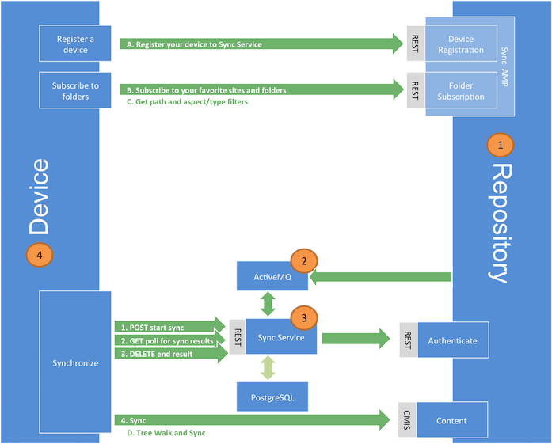

# Desktop Sync overview

With Desktop Sync capability, users can now sync content between their desktop \(client with the Desktop Sync application\) and the Alfresco repository. Use this information to know more about the components of the Desktop Sync service and the flow of information between the repository and the desktop during the synchronization process.

**Important:** Desktop Sync will replicate content on local desktops for users with the appropriate access. If replication outside the Alfresco repository is not allowed by your content policy you should not deploy Desktop Sync.

**Important:** This version of Desktop Sync does not support Smart Folders and Records Management. If Records Management controlled content is synced, note that moving, renaming, or hiding of declared records may not be reflected on the desktop client.

The Desktop Sync service synchronizes files between the desktop and Alfresco repository using web services. The application currently synchronizes files in the document library of any site a user has access to. Because the content is synchronized automatically between both sides, the users can easily share information between devices. This allows for easy, automatic updates and backup of your data. Share automatically recognizes the updates made to the content via the device and adopts them by synchronizing the data.

**Components of Desktop Sync**

As shown in the diagram below, the main components of the Desktop Sync application are:

1.  **Alfresco repository**: This is where the content, the indexes, and the database resides.
2.  **Changes queue**: This is where the Alfresco repository writes messages about changes to the files, folders, subscriptions and device registrations. This is managed by ActiveMQ.
3.  **Synchronization service:** This service keeps a record of all the changes. It manages a set of devices and computes the differences between the views that all the devices have of content, and the view that Alfresco repository has of the content.
4.  **Device**: This specifies the desktop with which the user interacts. It receives and adds content from/to the repository directly.

**Information flow**

The synchronization process is based on the concept that the repository will publish messages when events happen that may be of interest to the clients. The clients can find out about these events and use the information to stay in sync with the repository.

The Alfresco repository communicates any changes made to the files, folders, subscriptions and device registrations via a queue. The synchronization service reads the messages in the queue and persists the changes in the PostgreSQL database. It determines and records whether the device view of a particular file is different from the repository's view of that file. The device makes a `GET` change service request to the synchronization service to get an update on any resources that have changed since the particular device was last synced. The synchronization service communicates the changes \(if any\) to the device. The device uses CMIS and the changed data from the synchronization service to bring the client and the repository in sync.

The desktop can register and synchronize content directly to the repository. For more information, see [Desktop Sync process](desktop-sync-process.md).

-   **[Desktop Sync process](../concepts/desktop-sync-process.md)**  
When you log in to Desktop Sync for the first time, your device gets registered using the REST API in the repository Sync AMP. This creates an association in the repository between the person node and the device node.

**Parent topic:**[Administering Desktop Sync](../concepts/desktop-sync.md)

