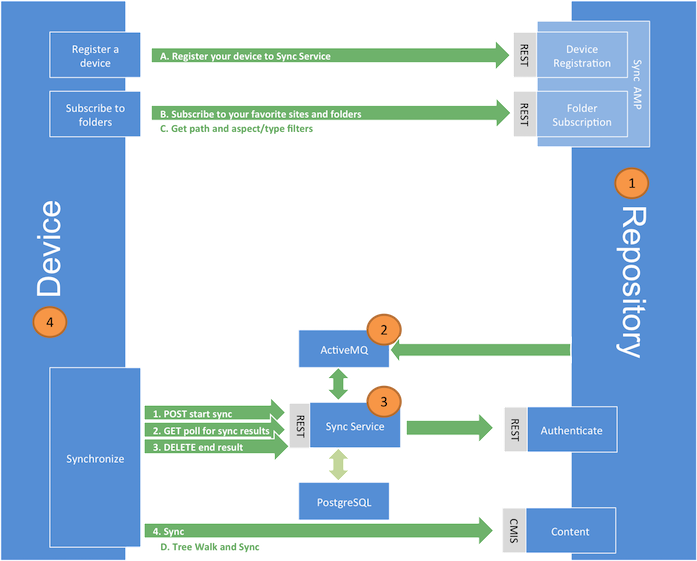

# Desktop Sync overview

With Alfresco Desktop Sync, users can sync content between their desktop and the repository. Use this information to find out more about the components of the Sync Service and the flow of information between the repository and the desktop during the synchronization process.

**Important:** Desktop Sync will replicate content on local desktops for users with the appropriate access. If replication outside the repository is not allowed by your content policy you should not deploy Desktop Sync.

**Important:** Desktop Sync can't synchronize content that appears in Smart Folders.

**Important:** The Desktop Sync 1.0.x clients do not support Records Management or Governance Services. If Governance Services controlled content is synced, note that moving, renaming, or hiding declared records and classified files may not be reflected on the desktop client. It is recommended that you upgrade to Desktop Sync 1.1.

The Sync Service synchronizes files between the desktop and the repository using web services. The application currently synchronizes files in the document library of any site a user has access to. Because the content is synchronized automatically between both sides, the users can easily share information between devices. This allows for easy, automatic updates and backup of your data. Share automatically recognizes the updates made to the content via the device and adopts them by synchronizing the data.

**Components of Desktop Sync**

The main components of the Desktop Sync application are:

1.  **Repository**: This is the repository where the files, indexes, and database resides.
2.  **Active MQ**: This is where the Alfresco repository writes messages about changes to the files, folders, subscriptions and device registrations.
3.  **Sync Service:** This service keeps a record of all the changes. It manages a set of devices and computes the differences between the copy that all devices have of content, and the content that Alfresco repository has of the content.
4.  **Device**: This specifies the desktop with which the user interacts. It receives and adds content from/to the repository directly.

**Information flow**

The synchronization process is based on the concept that the repository will publish messages when events happen that may be of interest to the clients. The clients then request the relevant events and use the information to stay in sync with the repository.

The Alfresco repository communicates any changes made to the files, folders, subscriptions and device registrations via a queue. The Sync Service reads the messages in the queue and persists the changes in the database. It determines and records whether the device copy of a particular file differs from the repository. The device makes a `GET` change service request to the Sync Service to get an update on any resources that have changed since the device was last synced. The Sync Service communicates the changes \(if any\) to the device. The device then uses CMIS and the changed data from the Sync Service to bring the client and the repository in sync.

The desktop can register and synchronize content directly to the repository. For more information, see [Desktop Sync process](desktop-sync-process.md).

-   **[Desktop Sync process](../concepts/desktop-sync-process.md)**  
When you log in to Desktop Sync for the first time, your device gets registered using the REST API in the repository Sync AMP. This creates an association in the repository between the person node and the device node.

**Parent topic:**[Alfresco Sync Service 2.2](../concepts/syncservice-overview.md)

