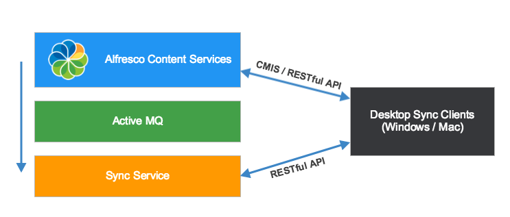

# Alfresco Sync Service 2.2

Alfresco Sync Service is an add-on module that synchronizes files between the desktop and repository using web services. It's part of the Desktop Sync solution that consists of three components: Sync Service, Desktop Sync for Windows, and Desktop Sync for Mac. This documentation describes how to install, configure, and administer the Sync Service.

Here is a summary of the key capabilities in 2.2:

-   Clustering for scalability support
-   Added support for more databases: Oracle, MySQL, and AWS Aurora MySQL
-   Support for AWS deployment
-   More events monitoring, such as for Governance Services and permission changes

**Important:** The Sync Service 2.2 module can be applied to Alfresco One, and Alfresco Content Services. See [Prerequisites and supported platforms](desktop-sync-prerequisites.md) for more.

The following diagram shows a simple representation of how Alfresco Content Services and the Sync Service interact with the Desktop Sync clients. See [Desktop Sync overview](desktop-sync-overview.md) for more.

For earlier releases of the Sync Service, see the **Previous versions** section of [http://docs.alfresco.com](https://docs.alfresco.com).

-   **[Desktop Sync overview](../concepts/desktop-sync-overview.md)**  
With Alfresco Desktop Sync, users can sync content between their desktop and the repository. Use this information to find out more about the components of the Sync Service and the flow of information between the repository and the desktop during the synchronization process.
-   **[Installing and configuring Sync Service](../concepts/desktopsync-admin.md)**  
The Sync Service capability for Desktop Sync is delivered as a distribution zip file containing repository AMP file, server files for the Sync Service, ActiveMQ, and third-party license information.
-   **[Upgrading Sync Service](../tasks/ds-upgrade.md)**  
Use these instructions to upgrade your instance of the Sync Service from version 2.1.x to version 2.2.0.
-   **[Administering Sync Service](../concepts/desktop-sync.md)**  
This section provides an overview of the Sync Service and describes how to configure it.
-   **[Troubleshooting Sync Service](../concepts/desktop-sync-troubleshooting.md)**  
Sorry you're having trouble syncing Sync Service.
-   **[Sync Service Admin FAQs](../references/ds-faqs-admin.md)**  
Here's a list of common questions about administering Sync Service.
-   **[Copyright](../reuse/copyright.md)**  

-   **[Disclaimer](../reuse/disclaimer.md)**  

