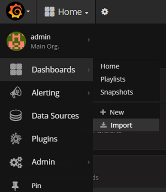

# Importing an existing dashboard in Grafana

Use these instructions to import an existing dashboard into Grafana.

You can import a dashboard that you saved as part of [Creating your first dashboard in Grafana](ds-grafana-dash-new.md).

1.  Open your browser and enter `http://<Grafana-host>:3000`.

2.  Click **Dashboards** then **Import**:

    

3.  Find the file you saved in step [6](ds-grafana-dash-new.md#6) of [Creating your first dashboard in Grafana](ds-grafana-dash-new.md) then import it.

**Parent topic:**[Monitoring Sync Service](../concepts/desktop-sync-monitor.md)

