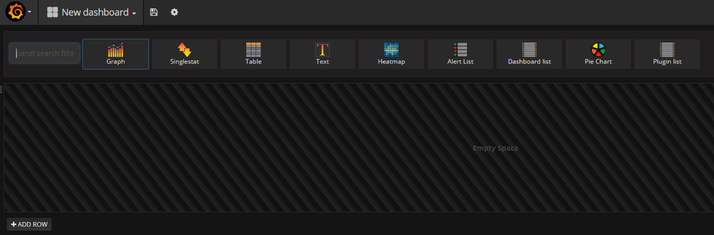
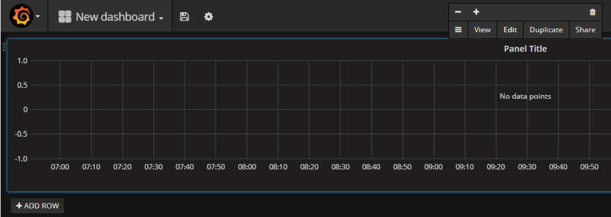
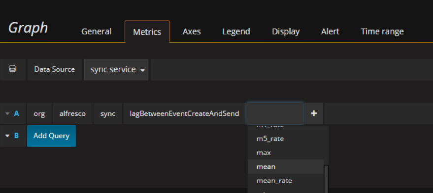
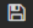

# Creating your first dashboard in Grafana

Use these instructions to create your first dashboard in Grafana, and start creating graphs/charts.

1.  Open your browser and enter `http://<Grafana-host>:3000`.

2.  Click **Create your first dashboard**.

3.  Add a new graph by selecting a graph type:

    

4.  Click **Panel Title** \> **Edit** to select the metric to display in this graph:

    

5.  In the Metrics tab, select the Graphite **Data Source**, and the metric's value to display \(such as the mean, 99th percentile, etc.\).

    

6.  Click the disk icon  to save the dashboard.

If you've previously saved a dashboard, you can import it using the steps in [Importing an existing dashboard in Grafana](ds-grafana-dash-import.md).

**Parent topic:**[Monitoring Sync Service](../concepts/desktop-sync-monitor.md)

