A user's role determines what they can and cannot do in a site. Each role has a default set of permissions.

The following sections describe these permissions. In general:

* Managers have full rights to all site content - what they have created themselves and what other site members have created.
* Collaborators have full rights to the site content that they own; they have rights to edit but not delete content created by other site members.
* Contributors have full rights to the site content that they own; they cannot edit or delete content created by other site members.
* Consumers have view-only rights in a site: they cannot create their own content.

> **Note:** As well as these four default roles you might also see additional roles in different places in Alfresco Share.

* Coordinator - has full rights to all content - what they have created themselves and what others have created.
* Editor - has rights to edit file properties and check files in and out; they cannot create their own content.

Your Alfresco Administrator can also add additional roles.

Site managers can [change a site role](link ../tasks/members-change-role.md) for the site users.

If you're a member of two user groups which have different permissions then you will get the sum total of all the permissions. For example, if Group 1 has permission to view a file and Group 2 has permission to view and edit a file, then you would have view and edit permission for the file.

> **Note:** Site content can be defined as any content created or added to a site. This includes, but is not limited to, wiki pages, blog postings, library folders and items, calendar events, discussion topics, and comments on any content.

## Dashboards permissions

The following sections detail the user permissions for dashboards (personal and site) and dashlets.

Each user has full access to the toolbar and dashlet functionality available on the personal dashboard.

### Site dashboard

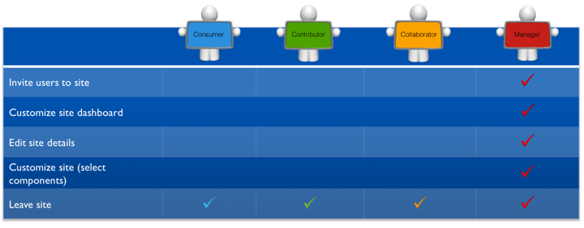

### Site dashlets

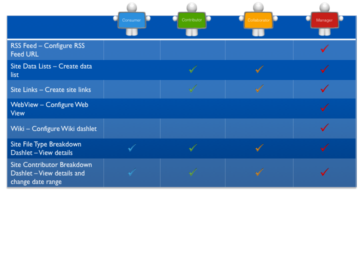

## Content permissions

The following sections detail the user permissions for content.

### Document Library

Folders and files:

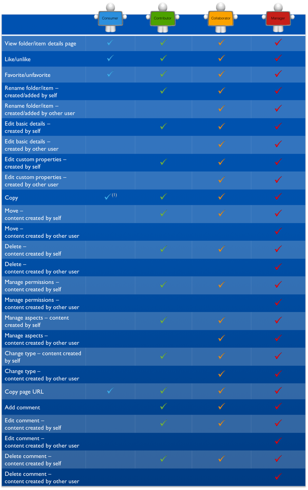

(1) A user with the role Consumer can copy a folder or file to another site if the user performing the action has the role of Manager, Collaborator, or Contributor in the target site.

> **Tip:** Consumers who previously held a site role where they were able to add content retain their previously held permissions for any content they have added.

Folders only:

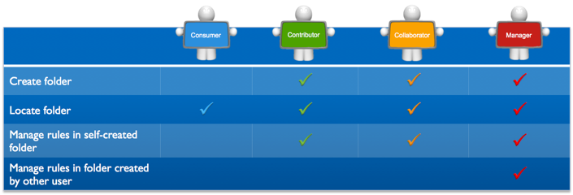

Files only:

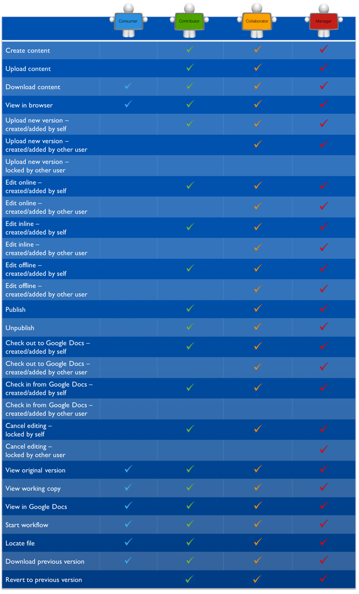

### Calendar

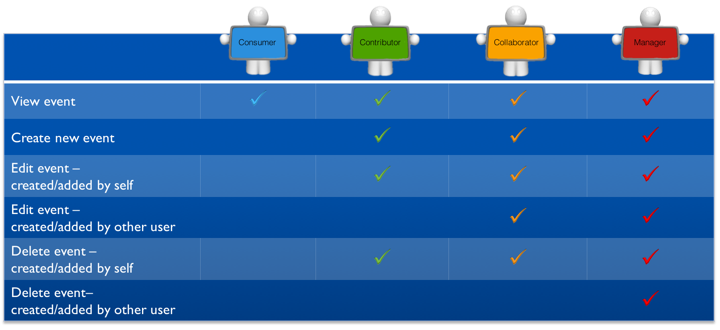

### Wiki

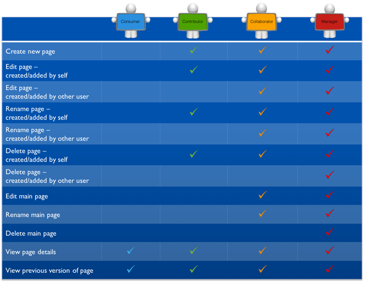

### Discussions

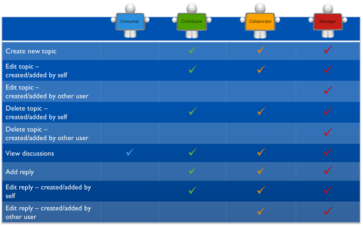

### Blog

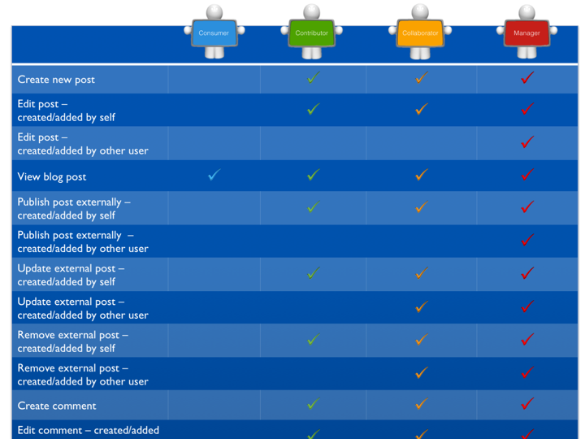

### Links

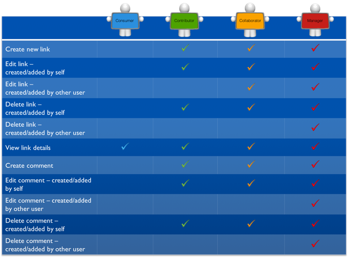

### Data Lists

## Member permissions

The following section details the member permissions.

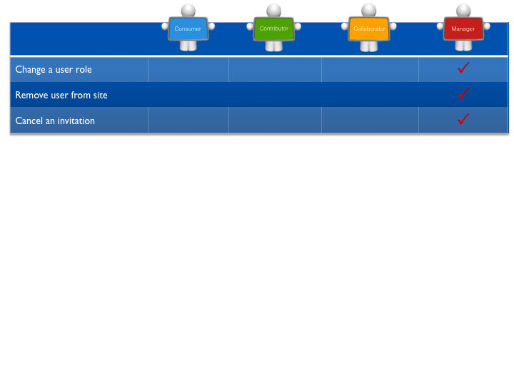
