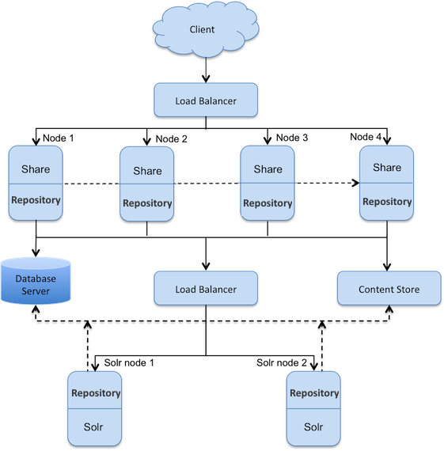

# Alfresco Index Engine

You can host a separate instance of Alfresco Content Services 6.2 or above with Solr 6 for high scalability and for maximizing the throughput of your Alfresco services. This setup is termed Alfresco Index Engine.

This setup shows a single repository database and content store. There are four nodes with Alfresco/Share and two nodes with Solr, all accessing the content simultaneously. This set up provides a higher level of availability, reliability, and scalability, thereby maximizing the throughput of various Alfresco services. Nodes in a cluster are positioned behind a load balancer that delegates requests to cluster members based on any one member’s ability/availability to handle the load.

Each Alfresco/Share instance is deployed into its own Tomcat servlet container. Alfresco services and CPU runtime footprint are optimized for high throughput under heavy concurrency with such a deployment. The load balancer fronts the cluster, and directs traffic to the member of the cluster most able to handle the current request.

**Note:** All the servers in a cluster should have static IP addresses assigned to them.

In this deployment scenario the following flows are present:

-   Client flow:
    -   Client sends the request to the main load balancer to reach Share application.
    -   Main load balancer analyses the load and redirects the client to one of Share hosts.
    -   Main load balancer uses the JSESSIONID cookie to stick the client to one of Share nodes.
    -   Share sends the web scripts requests to the local repository instance, renders the page, and returns it to the user via the main load balancer.

-   Alfresco internal flow:
    -   Repositories intercommunication is done via Hazelcast to replicate caches.
    -   Repositories share the same contentstore available via NFS/SAMBA share.
    -   Repositories share the same database schema.

-   Alfresco Solr flow:
    -   Tracking tier: Two Solr instances periodically query repositories to detect new transactions, fetch new content, and build local indexes. Tracking is done through the Solr load balancer, which analyses the load and distributes it across the repositories.
    -   Search tier: Four repository instances query two Solr instances on demand through the Solr load balancer.

To implement this setup, see [Clustering for high throughput](https://docs.alfresco.com/6.1/tasks/install-config-alf.html).

**Parent topic:**[Installing and configuring Search and Insight Engine](../concepts/solr-install-config.md)

