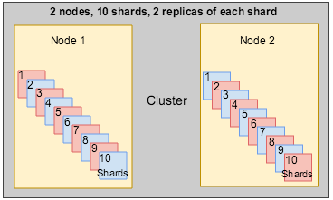

# Basic Solr sharding concepts

There are a few basic concepts that are core to understanding Solr sharding. Understanding these concepts from the outset will help in learning more about sharding.

**Useful terminology**

|Term|Description|
|----|-----------|
|Node|A node represents an Alfresco Content Services instance.|
|Cluster|A cluster is composed of one or more Alfresco Content Services nodes.|
|Shard group|A shard group is a collection of documents. It is composed of one or more shards.|
|Shard|An index is split into chunks called shards.|

**Basic concepts**

A cluster is a collection of one or more nodes \(servers\) that provide indexing and search capabilities across all nodes. A node is a single server that is part of your cluster, stores your data, and participates in the cluster's indexing and search capabilities.

An index is a collection of documents from the same store. An index can potentially store a large amount of data that can exceed the hardware limits of a single node. To solve this problem, Content Services provides the ability to subdivide your index into multiple pieces called shards.

When you create an index, you define the number of shards that you want. Each shard is in itself a fully-functional and independent Solr index that can be hosted on any index server. Index server includes a node which must be in the cluster. It is recommended to have a fail over mechanism in case a shard/node fails or goes offline. As a solution, you can make one or more copies of your index's shards into shard instances.

To summarize, each index can be split into multiple shards. An index can also be replicated zero \(meaning no instance\) or more times. A shard tracks the appropriate subset of information from the repository. The number of copies of the total index depends on the minimum number of instances for each shard.

**Parent topic:**[Solr sharding](../concepts/solr-shard-overview.md)

