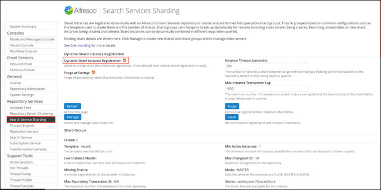
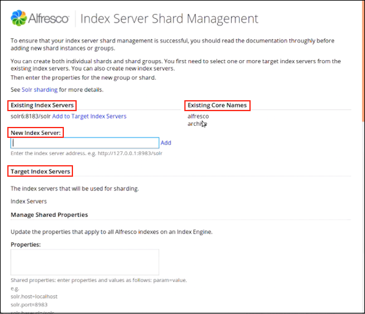
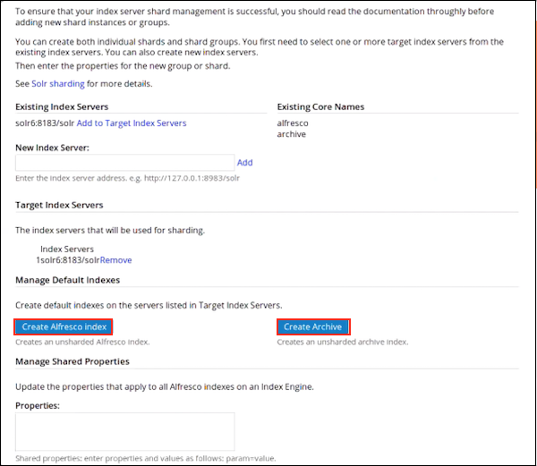
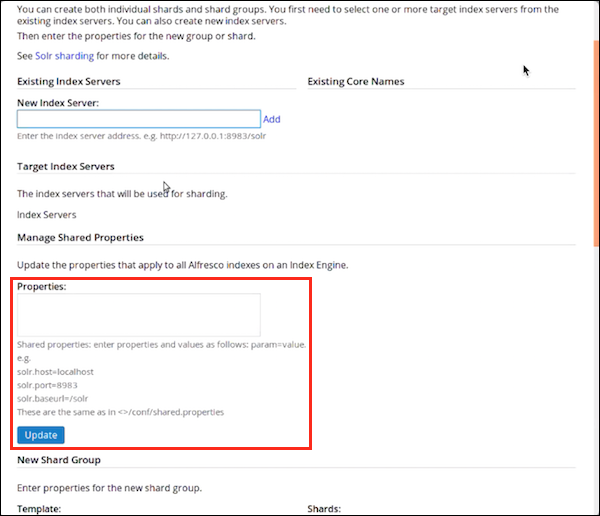
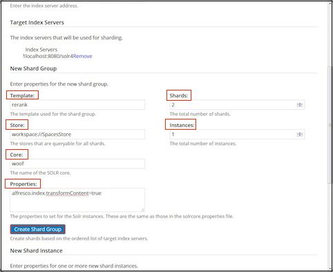
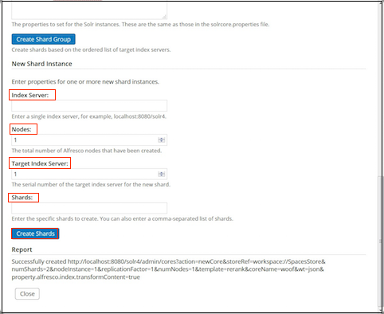
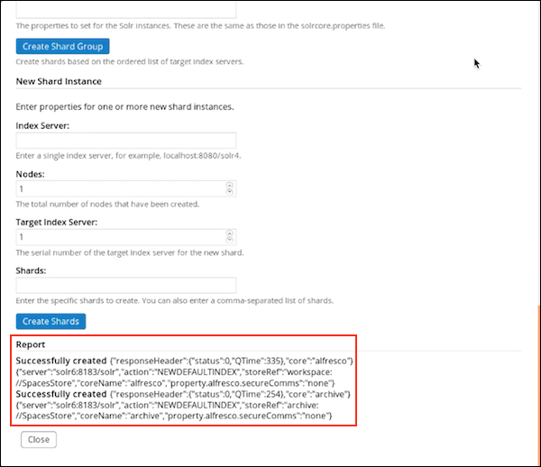
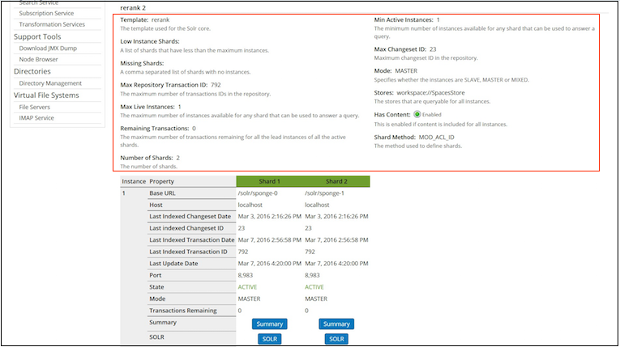
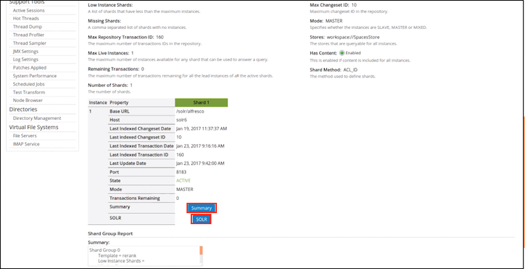

# Configuring Search and Insight Engine sharding using the Admin Console

Alfresco Search and Insight Engine supports sharded indexes with SSL. Use the Search Server Sharding page to set up and configure a Solr 6 sharded search index.

Prerequisites for viewing the Search Server Sharding page:

-   Check you have installed Alfresco Content Services 6.2 or above and have a valid license.
-   Support for shard groups requires a clustered license. Make sure that you enable clustering on your Alfresco Content Services license. For more information, see [Repository server clustering](https://docs.alfresco.com/6.1/tasks/adminconsole-reposerverclustering.html) and [Uploading a new license](https://docs.alfresco.com/6.1/tasks/at-adminconsole-license.html).

1.  Open the Admin Console. For more information, see [Launching the Admin Console](https://docs.alfresco.com/6.1/tasks/adminconsole-open.html).

2.  In Repository Services, click **Search Server Sharding**.

    You see the Search Server Sharding page. It displays information about dynamic shard index registration, shard groups, and shard instances.

    

3.  Under Dynamic Shard Instance Registration, select **Dynamic Shard Instance Registration** and set the other shard instance properties.

    |Shard registration property|Example setting|What is it?|
    |---------------------------|---------------|-----------|
    |**Dynamic Shard Instance Registration Enabled**|Yes|Select this property to enable dynamic shard instance registration. If disabled, manual shard registration is used.|
    |**Purge at Startup**|No|This property purges all persisted dynamic shard instance information at startup.|
    |**Instance Timeout \(seconds\)**|100|This specifies the number of seconds a shard instance can go without making a tracking call for transactions to the repository before it stops being used for queries.**Note:** When tracking large change sets or rebuilding your indexes, increase the shard timeout. For example, change the value of this property to 3200 or 7200 seconds.

|
    |**Max Instance Transaction Lag**|1000|This specifies the maximum number of transactions an instance can lag behind the lead instance of the shard before it stops being used for queries.|

4.  Click **Refresh** to refresh this page.

5.  Click **Purge** to remove all registered shard instance information and start from clean.

6.  Click **Clean** to remove inactive registered shard instance information.

7.  Click **Manage** to create and manage shard instances.

    You see the Index Server Shard Management window. Use this window to create individual shards or shard groups.

    

    1.  Use Existing Index Servers to view a list of existing index servers and to create new index servers.

        To add a new index server, specify the server address in **New Index Server** and click **Add**.

        You can view the newly created index server under Target Index Servers.

        Click **Add to Target Index Servers** next to the server you want to add to the list of target index servers. **Target Index Servers** displays a list of index servers where you want to make the new shards.

    2.  Under Existing Core Names, you can view a list of the core names already in use.

    3.  Under Target Index Servers, you can view a list of index servers that will be used for sharding.

        To remove an index server from the list of servers that will be used for sharding, click **Remove**.

    4.  Next, you need to create a core for the shard. There are two ways to do this. You can either:

        -   use the Manage Default Indexes and **Manage Shared Properties** sections to create default indexes - see Step 7 \(e\) and 7 \(f\); or
        -   use the New Shard Group and New Shard Instance sections to create a shard group and instance - see Step 7 \(g\) and 7 \(i\).
    5.  Use Manage Default Indexes to create default indexes on the servers listed in **Target Index Servers**.

        The Manage Default Indexes section:

        -   appears only when you add a new index server.
        -   creates a core for a given shard, and therefore, can be used as an alternative to creating shards using the **New Shard Group** section \(Step 7f\).
        

        **Important:** The cores are visible in the Solr Admin web application **only after** you create them using the Index Server Sharding page.

        -   Click **Create Alfresco Index** to create an unsharded Alfresco index.
        -   Click **Create Archive** to create an unsharded archive index.

            Use the **Report** section at the end of this page to view the detailed core creation message.

            Check the Solr Admin UI to ensure that both the indexes are correctly listed.

            

    6.  Use **Manage Shared Properties** to update the properties that apply to all Alfresco indexes on an Index Engine.

        

        These properties are the same as in alfresco-insight-engine-distribution-2.0.x.zip/solrhome/conf/shared.properties. For example:

        ```
        solr.host=localhost
        solr.port=8983
        solr.baseurl=/solr
        ```

    7.  Alternatively, to create a shard group, set the following properties under New Shard Group:

        |Shard group property|Example setting|What is it?|
        |--------------------|---------------|-----------|
        |**Template**|rerank|This specifies the template used for the shard group.|
        |**Store**|workspace://SpacesStore|This specifies the stores that are queryable for all shards.|
        |**Core**| |This specifies the name of the Solr core.|
        |**Properties**|`solr.suggester.enabled``alfresco.secureComms=https`

`alfresco.port.ssl=8443`

`alfresco.commitInterval=20000`

`alfresco.newSearcherInterval=30000`

|This specifies the properties to set on the Solr instances. These are the same properties that are set in the solrcore.properties file.|
        |**Shards**|1|This specifies the total number of shards.|
        |**Instances**|1|This specifies the total number of instances.|

        

    8.  Click **Create Shards Group** to create new shards based on the ordered list of target index servers.

    9.  To create a single shard instance, set the following properties under New Shard Instance:

        |Shard property|Example setting|What is it?|
        |--------------|---------------|-----------|
        |**Index Server URL**|localhost:8080/solr|This specifies the URL to a single index server.|
        |**Nodes**|1|This specifies the total number of Solr nodes that have been created.|
        |**Target Index Server**|1|This specifies, out of all the solr nodes above, the number given to the target index server node for this new shard.|
        |**Shards**| |This specifies the specific shards to create, on the node given above. You can also specify a comma-separated list of shards.|

        See [Installing and configuring Solr shards](install-solr-shards.md) to view examples of creating shards when calling the REST URLs directly.

        

    10. Click **Create Shards** to create the new shard based on the specified instance properties.

    11. Use Report to get detailed information on shard creation and execution.

        

    12. Click **Close** to close the Index Server Shard Management window.

    You have successfully created an `alfresco` core and an `archive` core. To verify, in a browser, navigate to the Solr URL, [https://localhost:8983/solr](https://localhost:8443/solr4). In the Solr Admin UI, select the core selector drop-down list and verify that both the `alfresco` and `archive` cores are present in the list.

    Validate that you can execute queries from the search public API to the archive core.

    ```
    curl -X POST --header 'Content-Type: application/json' --header 'Accept: application/json' --header 'Authorization: Basic YWRtaW46YWRtaW4=' -d '{
      "query": 
      {
        "query": "foo"
      },
      "scope": 
      {
        "stores": ["archive://SpacesStore"]
      }
    }' 'http://localhost:8080/alfresco/api/-default-/public/search/versions/1/search'
    ```

8.  Under Shard Groups, you can view information about all the shards in the group.

    |Shard registration property|Example setting|What is it?|
    |---------------------------|---------------|-----------|
    |**Template**|rerank|This specifies the template used for the Solr core.|
    |**Low Instance Shards**| |This specifies a list of shards that have less than the maximum number of instances.|
    |**Missing Shards**|100|This specifies a comma-separated list of shards with no instances.|
    |**Max Repository Transaction ID**|14,637|This specifies the maximum number of transaction IDs in the repository.|
    |**Max Live Instances**|1|This specifies the maximum number of instances available for any shard that can be used to answer a query.|
    |**Remaining Transactions**|2|This specifies the maximum number of transactions remaining for all the lead instances of all the active shards.|
    |**Number of Shards**|4|This specifies the total number of shards.|
    |**Min Active Instances**|1|This specifies the minimum number of instances available for any shard that can be used to answer a query.|
    |**Max Changeset ID**|104|This specifies the highest change set id in the repository.|
    |**Mode**|MASTER|This specifies whether the instances are `SLAVE`, `MASTER`, or `MIXED`. **Note:** The `SLAVE` and `MIXED` instances are not supported for a sharded installation.

|
    |**Stores**|workspace://SpacesStore|This specifies the stores that are queryable for all instances.|
    |**Has Content**|Enabled|This property is enabled if content is included for all instances.|
    |**Shard Method**|DB\_ID|This specifies the method used to define shards. The default shard method is `DB_ID`. You can specify your own shard method in Index Server Shard Management screen \> New Shard Group \> Properties. For example, `shard.method=ACL_ID`.

You can also set this property in the alfresco-insight-engine-distribution-2.0.x.zip/solrhome/templates/rerank/conf/solrcore.properties file.

|

    

9.  Use the instance property table to view detailed entity information for all the shards. This is the same information that is displayed in the JMX console, for example, `Base URL`, `Host`, `Last Indexed Changeset Date`, and more.

    For more information, see [Indexing information available in a JMX client](index-info-jmx.md#instance).

    1.  Click **Summary** to go to the [http://localhost:8983/solr/admin/cores?action=SUMMARY](http://localhost:8983/solr/admin/cores?action=SUMMARY) page on Solr for the specific core.

        For more information, see [Unindexed Solr Transactions](../concepts/solr-unindex.md).

        

    2.  Click **SOLR** to go to the Solr Admin screen for the specific core.

        For more information, see [Connecting to the SSL-protected Solr web application](ssl-protect-solrwebapp.md).

10. The Shard Group Report section displays information about the shard groups and instances. A tabular view of this information is displayed in the shard table in Step 9. This information is read-only.

    

11. Click **Save** to apply the changes you have made to the index server shards.

    If you do not want to save the changes, click **Cancel**.


**Note:** Alfresco recommends that you do not use the **Solr Admin Console \> Core Admin \> Unload** functionality to unload indexes \(either whole indexes or shards that are part of an index\). Unloading an index or a shard in this way will delete it and make it unavailable for query.

If you unload or delete a shard from the Solr Admin Console, make sure you restart the Solr server and restore your indexes so that Alfresco can work properly.

**Parent topic:**[Dynamic shard registration](../concepts/dynamic-sharding.md)

